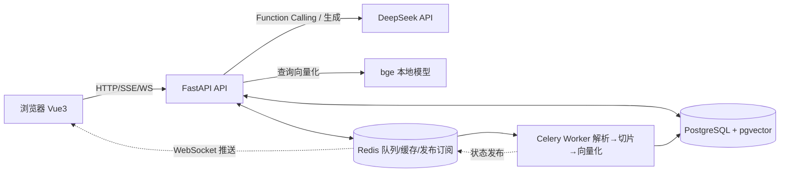

# RAG 知识库问答系统

企业级 RAG（检索增强生成）知识库问答系统：RAG / Agent 双模式问答、多知识库管理、
异步文档入库、混合检索、语义缓存、多轮查询改写、页码级引用、WebSocket 实时通知、
评估闭环与用量统计看板。

**技术栈**：FastAPI · PostgreSQL(pgvector) · Redis · Celery · Alembic · WebSocket · Prometheus · DeepSeek API（Function Calling）· 本地 bge Embedding · Vue 3 + Element Plus · ECharts · Docker Compose · GitHub Actions



## 功能特性

**AI / RAG**
- **双模式问答**：RAG 固定管道（改写→检索→生成，快）/ Agent 模式（Function Calling 多步工具循环，模型自主决定检索几次、用什么关键词，适合对比类复杂问题，工具调用过程前端实时可视化）
- 混合检索：pgvector 向量召回（HNSW 索引）+ **PostgreSQL 全文检索关键词召回**（jieba 分词 → tsvector + GIN 倒排索引 + ts_rank）→ RRF 融合，支持多查询扩展与交叉编码器重排
- **长对话滚动摘要**：旧轮次自动压缩成摘要，Prompt = 摘要 + 最近几轮，上下文成本不随轮数膨胀
- **语义缓存**：相似问题（向量相似度）直接秒回，延迟从秒级降到毫秒级、token 零成本；知识库变更自动失效
- 多轮查询改写："那第二条呢" 自动改写成独立完整问题再检索（前端展示改写结果）
- 引用溯源：回答带 [1][2] 编号，PDF 精确到页码，点开即可核对原文片段
- 推荐追问：回答完成后自动生成 3 个可继续提问的问题，一键追问
- **评估闭环**：自动从文档生成评估集 → Hit Rate@K / MRR 检索评估 → LLM-as-judge 回答忠实度/相关性评分
- 幻觉控制：System Prompt 强约束 + 低温度 + "知识库没有答案时明说"

**后端工程**
- 多知识库：文档分库管理，提问可限定检索范围，数据按用户严格隔离
- 异步入库：上传 202 秒回，Celery worker 解析/切片/向量化，状态经 Redis 发布订阅 + WebSocket 实时推送
- 双 Token 认证：短效 Access + 长效 Refresh（Redis 白名单、GETDEL 原子轮换防重放、登出吊销）
- **LLM 容错**：超时 + 有限重试（退避）+ 熔断器 + **备用模型自动切换**（主模型故障/熔断时切任意 OpenAI 兼容服务）；增强功能（改写/追问/缓存/摘要）全部静默降级，不影响核心链路
- 可观测性：Prometheus /metrics（HTTP + 检索/LLM 首字延迟直方图）、**全链路请求 ID 日志**、健康检查探测 DB/Redis、token 用量落库与看板
- 工程化：Alembic 迁移、Redis 分布式限流、大文件流式上传校验、单元测试、**Locust 压测脚本**、Flower 队列监控、**GitHub Actions CI**（ruff + pytest）、MIT License

**前端**
- Vue 3 + Element Plus 单页应用（依赖全部本地化，不依赖外网 CDN）
- 深色/浅色主题、Markdown 渲染 + 代码高亮（XSS 过滤）、会话历史恢复、拖拽上传

## 快速开始（推荐：Docker 一键启动）

前置条件：安装 [Docker Desktop](https://www.docker.com/products/docker-desktop/)。

```bash
# 1. 进入项目目录
cd rag-knowledge-base

# 2. 配置 API Key：复制 .env.example 为 .env，填入 DeepSeek Key
#    Key 在 https://platform.deepseek.com 注册后创建（充值 10 元够用很久）
copy .env.example .env       # Windows（Mac/Linux 用 cp）
# 用记事本打开 .env，把 LLM_API_KEY 改成你的真实 Key

# 3. 一键启动（首次构建约 5-10 分钟：装依赖 + 下载前端库到本地）
docker compose up -d --build

# 4. 看日志确认启动成功
docker compose logs -f api
```

- 应用入口：**http://localhost:8000**
- 接口文档（Swagger）：http://localhost:8000/docs
- Prometheus 指标：http://localhost:8000/metrics
- Celery 监控面板（Flower）：http://localhost:5555

可选增强（compose profiles）：

```bash
docker compose --profile monitoring up -d   # + Prometheus(9090) + Grafana(3000, admin/admin, 预置大盘)
docker compose --profile edge up -d         # + Caddy 反代（配 DOMAIN 环境变量自动 HTTPS）
```

部署到云服务器做成线上 Demo：见 [docs/生产部署.md](docs/生产部署.md)。

> 首次上传文档时，worker 自动从 HuggingFace 镜像下载 bge-small-zh 向量模型（约 100MB），缓存在 Docker 卷中不重复下载。

### 使用流程

1. 注册账号 → 进入「知识库」页新建知识库 → 拖拽上传 PDF/Word/MD/TXT
2. 右上角会实时弹出处理进度通知（WebSocket 推送，无需刷新）
3. 到「对话」页选择检索范围提问，回答流式输出、附引用来源与推荐追问
4. 「用量统计」页查看提问次数、token 消耗和延迟趋势

### 常见问题

| 问题 | 解决办法 |
|---|---|
| 上传后一直“处理中” | `docker compose logs -f worker`，首次是在下载向量模型，耐心等待 |
| 回答报“生成失败” | 检查 .env 的 LLM_API_KEY 是否正确、DeepSeek 账户是否有余额 |
| 前端库下载失败（构建时） | 重新执行 `docker compose build`（脚本会走 npmmirror 国内镜像并自动重试 unpkg） |
| 端口被占用 | 修改 docker-compose.yml 端口映射，如 `"8001:8000"` |

## 本地开发（不用 Docker）

需要 Python 3.11+、PostgreSQL（带 pgvector 扩展）、Redis。

```bash
pip install -r requirements.txt
python scripts/download_vendor.py          # 下载前端库到 app/static/vendor（一次即可）
copy .env.example .env                     # 填 LLM_API_KEY，按需改 DATABASE_URL / REDIS_URL

alembic upgrade head                       # 建表（或设 AUTO_CREATE_TABLES=true 跳过迁移）

# 终端 1：API
uvicorn app.main:app --reload
# 终端 2：Celery worker（Windows 需加 --pool=solo）
celery -A app.tasks worker --loglevel=info --concurrency=1
```

## 测试、评估与压测

```bash
pytest                                     # 单元测试（切片/RRF/JWT/Token 轮换/熔断器/语义缓存）
ruff check app tests scripts               # 代码检查（CI 同款）

# --- 评估闭环（服务启动、文档入库后）---
python scripts/gen_eval_set.py --samples 20                                  # ① 自动生成评估集
python scripts/eval_retrieval.py --user U --password P --file eval_set.jsonl # ② 检索 Hit Rate@K / MRR
python scripts/eval_answers.py  --user U --password P --file eval_set.jsonl  # ③ LLM 评审回答忠实度/相关性

# --- 压测（拿真实 QPS/P95 数据）---
pip install locust
locust -f scripts/loadtest.py --host http://localhost:8000   # 打开 localhost:8089 设置并发
```

调整 `CHUNK_SIZE` / `RETRIEVAL_TOP_K` / `MULTI_QUERY_ENABLED` / `RERANK_ENABLED` 等参数后重跑评估，可量化对比检索效果。把项目打造成简历主打的完整操作（GitHub 摆法、简历模板、STAR 故事）见 [docs/求职包装指南.md](docs/求职包装指南.md)。

## 项目结构

```
rag-knowledge-base/
├── app/
│   ├── main.py               # 入口：路由、指标中间件、健康检查、/metrics
│   ├── config.py             # 全局配置（环境变量 / .env 覆盖）
│   ├── db.py                 # 引擎：API 异步 / worker 同步
│   ├── models.py             # ORM：用户/知识库/文档/切片(向量)/会话/消息/用量
│   ├── security.py           # bcrypt + 双 Token JWT（类型校验）
│   ├── metrics.py            # Prometheus 指标定义
│   ├── limiter.py            # 限流（可切 Redis 存储）
│   ├── routers/
│   │   ├── auth.py           # 注册/登录/刷新/登出/me
│   │   ├── kb.py             # 知识库 CRUD
│   │   ├── documents.py      # 上传（流式落盘）/列表/删除
│   │   ├── chat.py           # SSE 问答：改写→检索→流式生成→用量落库→推荐追问
│   │   ├── stats.py          # 用量统计（总览 + 日趋势）
│   │   └── ws.py             # WebSocket：Redis 订阅 → 浏览器推送
│   ├── services/
│   │   ├── parser.py         # PDF(带页码)/DOCX/MD/TXT 解析
│   │   ├── chunker.py        # 递归切片（段落→句子→硬切，带重叠）
│   │   ├── embedder.py       # 本地 bge 向量化（懒加载单例）
│   │   ├── retriever.py      # 混合检索 + RRF + 可选重排（支持限定知识库）
│   │   ├── llm.py            # DeepSeek：流式回答/查询改写/推荐追问
│   │   ├── history.py        # 对话历史（PG + Redis Cache-Aside）
│   │   ├── tokens.py         # Refresh Token 白名单（轮换/吊销）
│   │   └── notify.py         # Redis 发布订阅（worker → API → WebSocket）
│   ├── tasks/ingest.py       # 入库流水线（Celery，状态实时发布）
│   └── static/               # Vue 3 前端（vendor 本地化）
├── migrations/               # Alembic 迁移
├── tests/                    # 单元测试
├── scripts/
│   ├── download_vendor.py    # 前端依赖本地化下载
│   └── eval_retrieval.py     # 检索质量评估（Hit Rate / MRR）
├── docs/                     # 架构设计、面试要点、升级说明
├── docker-compose.yml        # pgvector + Redis + API + Worker + Flower
└── Dockerfile
```

设计细节见 [docs/架构设计.md](docs/架构设计.md)，面试准备见 [docs/面试要点.md](docs/面试要点.md)，v2 变更见 [docs/升级说明.md](docs/升级说明.md)。
