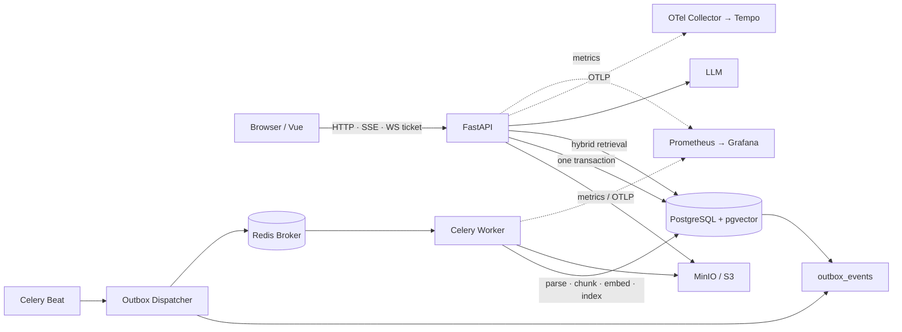

# 企业知识库 RAG 平台

面向后端工程实践的多租户知识库平台。项目重点不是继续堆叠 AI 名词，而是解决四个可验证问题：

1. 数据库提交后，入库任务最终可达且重复投递不产生重复切片；
2. 索引策略与 RAG 质量可以固定评估、消融比较和回归；
3. Organization / Workspace / RBAC / PostgreSQL RLS 形成多租户纵深隔离；
4. API、Celery、数据库和 Redis 的关键链路可追踪，异步任务可恢复，业务变更可审计。

技术栈：FastAPI、PostgreSQL 16、pgvector、Redis、Celery、MinIO/S3、OpenTelemetry、
Prometheus、Grafana、Tempo、DeepSeek/OpenAI-compatible API、Vue 3、Docker Compose。

完整的解析、查询、检索、重排、上下文、评测和安全能力对照见
[RAG 能力落实矩阵](docs/RAG能力矩阵.md)。

## 架构



### 可靠入库与无停机重建

上传接口流式计算 SHA-256，校验扩展名、MIME、PDF/DOCX 文件头、文件大小和工作区配额。对象写入
MinIO/S3 后，在一个数据库事务中同时写入 `documents`、`outbox_events` 和审计事件。Broker 故障不会
让文档永久停在 pending；Dispatcher 按指数退避重试，超过上限进入可查询的 failed 状态。

文档状态机：

```text
uploaded → queued → parsing → chunking → embedding → indexing → ready
                       ↘ retrying / failed / cancelled
deleting → deleted
```

Worker 使用 `status + processing_token` 做 CAS 抢占，开启 `acks_late`、worker-lost 重投、软硬超时和
有限退避重试。Embedding 按 batch 落盘 checkpoint 并刷新租约心跳；Worker 丢失后对账任务回收租约并
重新入队。重试耗尽进入 `dead_letter_tasks`，管理员可在 `/admin` 人工重放；重新入队会从解析开始，
流水线指纹一致时自动复用已提交的 Embedding checkpoint。索引写入新的
`index_version`，新切片全部写入成功后才原子更新 `active_index_version`；重建过程中检索继续读取旧版本。
唯一约束为：

```text
UNIQUE(document_id, seq, index_version)
```

删除走最终一致性：`deleting`（立即退出检索）→ `resource.delete` Outbox → Worker 可靠删对象 → 硬删行。定时对账任务
负责恢复心跳过期的 Worker、扫描孤儿对象和清理明确指定的旧索引版本。

### 可测量 RAG

- pgvector HNSW 向量召回；
- PostgreSQL `tsvector + GIN` 全文召回；
- RRF 融合、可选 CrossEncoder Reranker；
- Parent-Child Retrieval：小切片召回、父段落送入模型；
- Multi-query、长对话查询改写；
- 证据数量/分数门控，证据不足直接拒答；
- 间接 Prompt Injection：风险分级（none/medium/high）、可疑 Chunk 降权或移除、可选入库隔离区与管理员放行；
- 生成后引用编号、越界引用、未引用事实句检查；可选 LLM Claim-Evidence 语义蕴含校验
  （`CITATION_ENTAILMENT_ENABLED=true`）。

`ChatRequest.retrieval_profile` 可以选择：

```text
vector | hybrid | hybrid_rerank | parent_child | multi_query
```

[固定人工评估集](eval/golden_set.jsonl)覆盖事实、同义改写、编号、跨段对比、权限、无答案和恶意文档。
评估脚本输出 Hit Rate@5、MRR、nDCG@5、无答案误答率和检索 P95；质量门禁比较当前报告与主分支实测
基线。CI 额外跑离线 hybrid 检索门禁与 Prompt Injection 发布门禁。仓库只保留带时间与模型信息的
实测报告，不填造未经运行的提升数字。

消融与 Agent 对比（需服务已启动且夹具已入库）：

```bash
python scripts/run_ablation.py --user USER --password PASS
python scripts/eval_rag_vs_agent.py --user USER --password PASS
```

### 多租户、安全和审计

```text
Organization
└── Workspace
    ├── Membership (Owner / Admin / Editor / Viewer / Auditor)
    └── Knowledge Base
        └── Documents
```

API 层执行 RBAC；数据库层通过 `SET LOCAL app.user_id` 和 PostgreSQL RLS 再做一次行隔离。Compose
为迁移、API 和 Worker 使用不同数据库角色：`rag_admin` 拥有 schema，`rag_app` 是受 RLS 约束的
非 owner 角色，`rag_worker` 仅用于受信后台任务并具有 BYPASSRLS。

审计日志记录 actor、workspace、action、resource、IP、request_id、trace_id 和变更前后字段。
数据库触发器阻止普通 UPDATE/DELETE；INSERT 触发器维护哈希链（`prev_hash` / `entry_hash`）。
业务接口只能追加；管理员可检索与导出 JSONL，过期记录归档到对象存储后再清理。

运维管理页：<http://localhost:8000/admin>（死信、隔离区、checkpoint 感知的重新入队、审计导出）。

浏览器端：

- Refresh Token：`HttpOnly + SameSite` Cookie；
- Access Token：仅保存在 JavaScript 内存；
- Refresh Token family：用 Redis `GETDEL` 原子消费一次性 jti，旧 Token 重放时吊销整个 family；
- WebSocket：使用 Redis 中一次消费、默认 60 秒有效的 Ticket，不在 URL 中传 Access Token。

Agent 工具均为只读；检索文档被明确标记为不可信数据。容器以 UID 10001 非 root 运行，PostgreSQL、
Redis、Prometheus、Grafana 和 Flower 不对公网地址暴露；`.dockerignore` 排除 `.env` 和构建产物，
生产 Secret 没有代码内默认值。

### 可观测与运维

- HTTP request_id；
- OpenTelemetry：自动埋点 FastAPI、SQLAlchemy、Redis、Celery，OTLP 可接 Collector + Tempo；
- Prometheus：HTTP、检索、首 Token、缓存、Token、入库阶段、队列延迟、重试、Outbox 堆积；
- Grafana 数据源：Prometheus + Tempo；
- SLO 告警示例：5xx 比例、首 Token P95、Outbox 堆积、入库失败；
- 可用性 recording rules 与 30 天错误预算燃烧率告警（见 `monitoring/slo-recording.yml`）；
- 健康检查仅返回依赖是否可用，不泄露原始异常。

## 快速启动

要求 Docker Compose（Windows/macOS 可用 Docker Desktop，Linux 可用 Docker Engine + Compose plugin）。
先复制配置并替换所有 `change-me`：

```powershell
Copy-Item .env.example .env
docker compose up -d --build
docker compose logs -f api worker beat
```

Linux/macOS 使用 `cp .env.example .env`。`/api/health` 只探测 PostgreSQL 和 Redis；MinIO 与 LLM
需结合容器 healthcheck、日志和实际上传/问答冒烟验证。

应用：<http://localhost:8000>

Swagger：<http://localhost:8000/docs>

MinIO Console：<http://localhost:9001>

监控与链路追踪：

```bash
# .env 中设置 OTEL_EXPORTER_OTLP_ENDPOINT=http://otel-collector:4318
docker compose --profile monitoring up -d
```

Flower 属于运维 profile，且必须设置 Basic Auth：

```bash
docker compose --profile ops up -d flower
```

当前迁移头为 `0009`。旧库跨越 `0003 → 0004` 前必须停止写入并回填真实文件哈希；不同起始版本的
准确顺序见 [升级说明](docs/升级说明.md)。迁移不会为历史文件伪造哈希。

## 测试与质量门禁

```powershell
ruff check app tests scripts
pytest -q

# 使用真实 PostgreSQL/pgvector、Redis
$env:RUN_INTEGRATION="1"
$env:DATABASE_URL="postgresql+psycopg://..."
$env:REDIS_URL="redis://..."
$env:RLS_DATABASE_URL="postgresql+psycopg://非owner测试角色..."
pytest tests/integration -q
```

真实依赖测试覆盖：

- SHA-256 唯一约束与对象/缓存清理；
- RBAC 读写隔离和非 owner 数据库角色下的 RLS；
- Broker 故障后 Outbox 重试、成功后不重复投递；
- Celery 重复交付不产生重复切片；
- 索引 v1 → v2 原子切换，旧版本在切换前后保持可查询；
- Refresh Token 一次轮换、旧 Token 重放与 family 吊销。

评估与门禁：

```powershell
python scripts/eval_retrieval.py --user USER --password PASS --profile hybrid --out eval/reports/hybrid.json
python scripts/check_quality_gate.py --baseline eval/baseline.json --current eval/reports/hybrid.json

python scripts/check_injection_gate.py
docker compose exec -T worker python scripts/verify_audit_chain.py
```

CI 在真实 PostgreSQL/pgvector、Redis 和 MinIO 上执行迁移、RLS/集成测试、故障注入测试、离线检索
质量门禁和 Prompt Injection 发布门禁。独立安全工作流执行 CodeQL、Dependency Review、Trivy
文件/Secret/镜像扫描，并生成源码与镜像 SBOM。

## 当前边界

以下内容没有伪装成已完成：

- `eval/golden_set.jsonl` 是可复现的最小夹具，不等于业务真实语料的 100～200 条人工集；
- Claim-Evidence 语义校验默认关闭（需 LLM Key）；开启后仍依赖评审模型质量，不是形式化证明；
- `eval/reports/ablation_summary.md` 保留了一次本地实测快照，但样本仅 10 条、含冷启动且不代表生产；
  RAG vs Agent 报告仍需在真实服务和夹具上运行脚本生成；
- HTTPS Demo、公开压测报告、Grafana/Tempo 截图和云环境故障演练结果需要部署后采集，仓库只提供
  Compose / Runbook / recording rules，不提交伪造运行证据。

详细设计见 [架构设计](docs/架构设计.md)，故障处置见 [运维 Runbook](docs/运维Runbook.md)。
准备项目面试时，可按 [项目拷打速成计划](docs/面试项目拷打速成计划.md) 结合代码逐日学习与自测。
