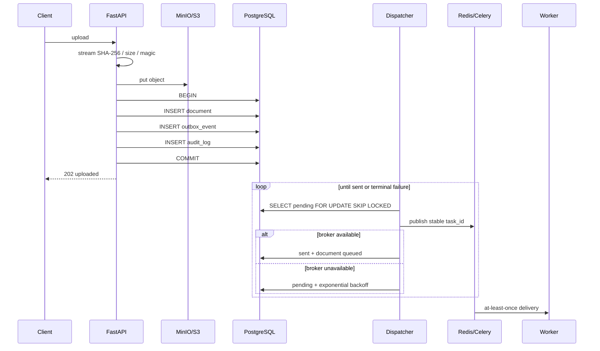
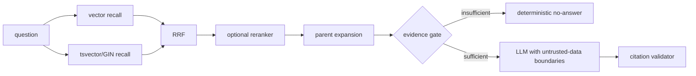

# 架构设计

## 1. 模块边界

项目保持模块化单体，不为了展示技术栈拆微服务：

- API：认证、RBAC、知识库、上传、SSE、WebSocket Ticket；
- Ingestion：Outbox Dispatcher、Celery 状态机、版本索引；
- Retrieval：向量、全文、RRF、Parent-Child、Reranker；
- Governance：Organization、Workspace、Membership、RLS、Audit；
- Operations：OpenTelemetry、Prometheus、对账任务、CI。

数据库是业务状态与任务投递意图的事实来源，Redis 不是事实来源。Redis 丢失后会影响缓存、实时通知和
Broker，但不会删除文档记录、Outbox 意图、索引版本或审计记录。

## 2. 上传和 Outbox 时序



对象存储先于数据库事务，因此数据库失败时 API 必须补偿删除对象。若进程恰好在补偿前崩溃，24 小时
安全窗口后的孤儿对象对账任务会清理它。数据库事务成功但 Broker 失败时，Outbox 保留投递意图。

## 3. Worker 状态机和原子索引

Worker 只能通过以下 CAS 获得执行权：

```sql
UPDATE documents
SET status = 'parsing',
    processing_token = :token,
    worker_id = :hostname,
    heartbeat_at = now()
WHERE id = :id
  AND status IN ('uploaded', 'queued', 'retrying')
RETURNING id;
```

每个阶段更新都要求相同 `processing_token`。Worker 丢失租约后不能激活索引。重建目标版本为
`active_index_version + 1`，写入与文档版本切换在一个事务完成：

```text
active=v1, target=v2
→ v2 parse/chunk/embed
→ INSERT v2 chunks
→ CAS active=v2, target=NULL, status=ready
→ COMMIT
```

失败或进程崩溃时 v1 不变。重复任务看到 `ready` 或执行中状态后直接退出。心跳对账会把超时任务转为
`retrying` 并写新的 Outbox 事件。

## 4. 检索和证据控制



所有查询同时受 workspace membership、kb_id 和 `Chunk.index_version ==
Document.active_index_version` 约束。Parent-Child 使用子切片 embedding 召回，按
`document_id + parent_seq` 去重后将父段落送入模型。

## 5. 多租户纵深隔离

应用权限矩阵：

| 权限 | Owner | Admin | Editor | Viewer | Auditor |
|---|---:|---:|---:|---:|---:|
| 查询知识库 | 是 | 是 | 是 | 是 | 否 |
| 上传/重建 | 是 | 是 | 是 | 否 | 否 |
| 删除 | 是 | 是 | 否 | 否 | 否 |
| 成员管理 | 是 | 是 | 否 | 否 | 否 |
| 审计日志 | 是 | 是 | 否 | 否 | 是 |

认证依赖在同一数据库事务设置：

```sql
SELECT set_config('app.user_id', :user_id, true);
```

RLS 策略通过 `workspace_memberships` 判断可见行。`rag_app` 不拥有表，因此无法绕过 RLS；
`rag_worker` 是独立受信角色，后台任务使用它执行系统级对账。迁移使用 `rag_admin`。

## 6. 一致性边界

- 数据库 + Outbox：强一致（同事务）；
- Outbox → Broker：至少一次；
- Broker → Worker：至少一次；
- Worker：CAS + 唯一约束实现幂等效果；
- 对象存储 + 数据库：补偿事务 + 定期对账；
- Redis 缓存：允许丢失，知识库变更按 KB 和 all-scope 失效；
- WebSocket 通知：实时提示，不是状态事实来源，断线后客户端读取 Document 状态。

## 7. 已知限制

当前引用检查是确定性规则，不能证明每个自然语言主张都被证据语义蕴含。完整 Claim-Evidence 判定应在
离线评估证明收益后引入，避免在主链路无依据地增加一次 LLM 调用。性能和质量数字只从环境生成的报告
进入文档，不在源码中预设。
