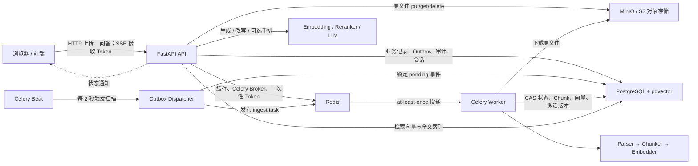
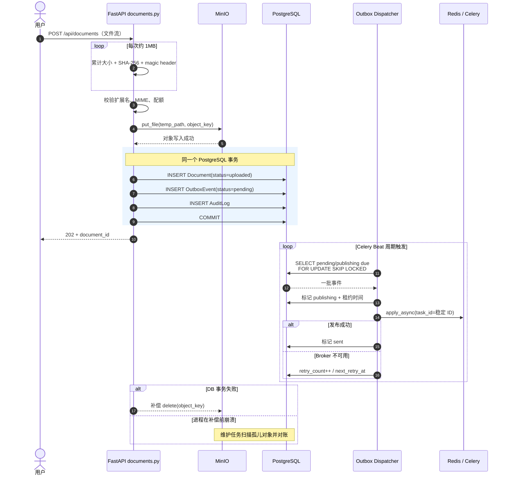
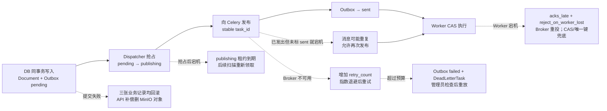
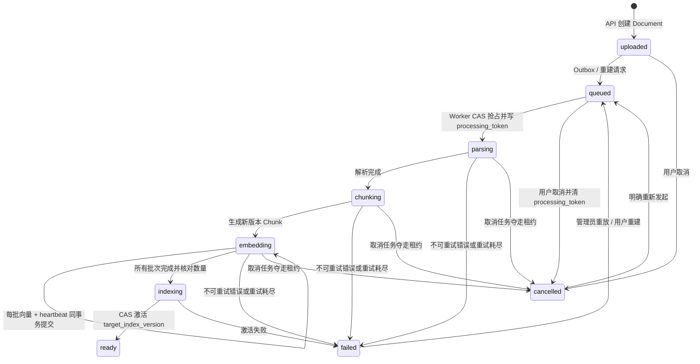
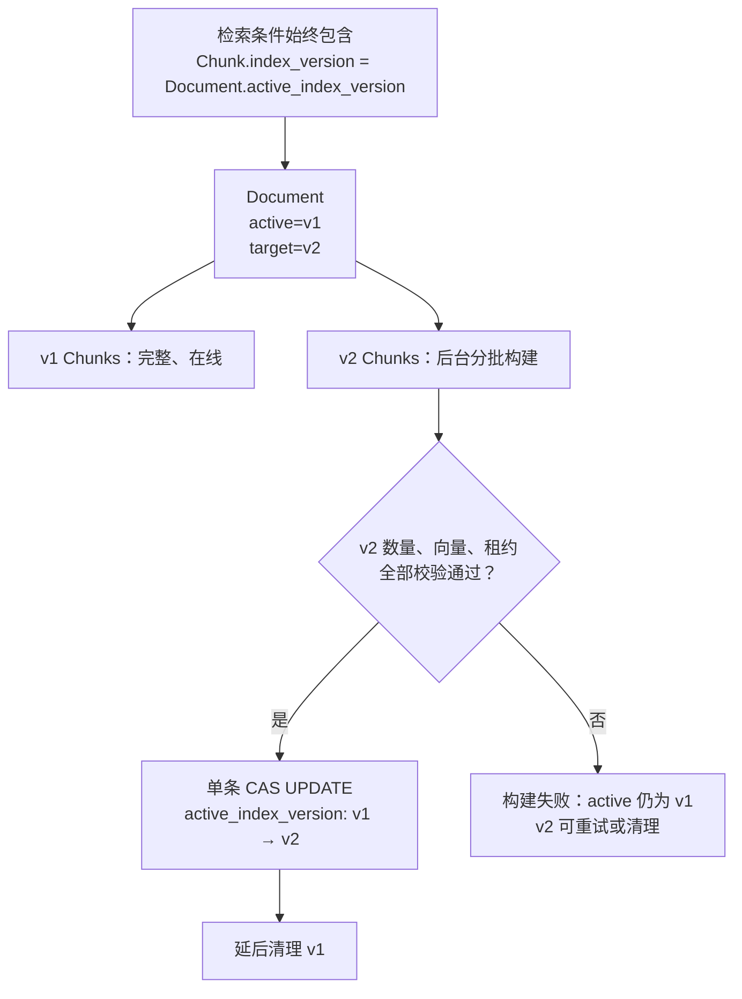
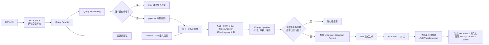
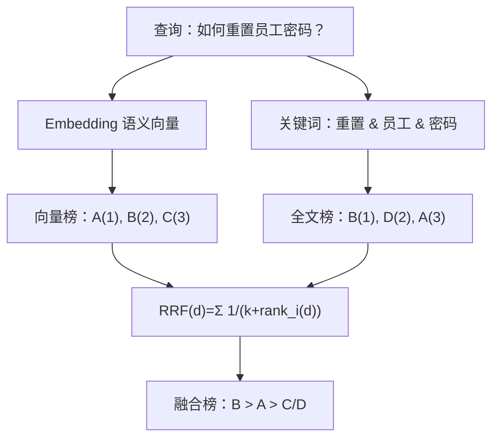
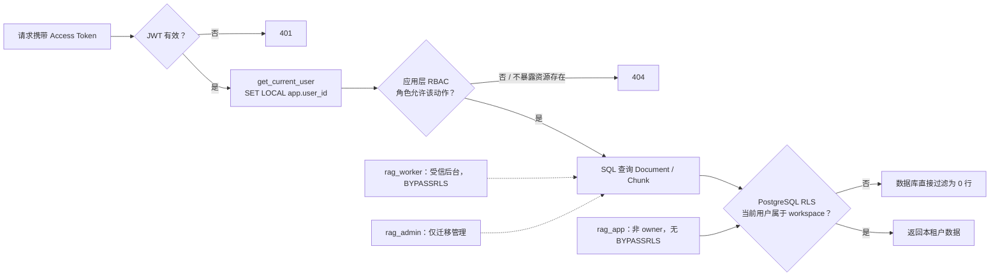
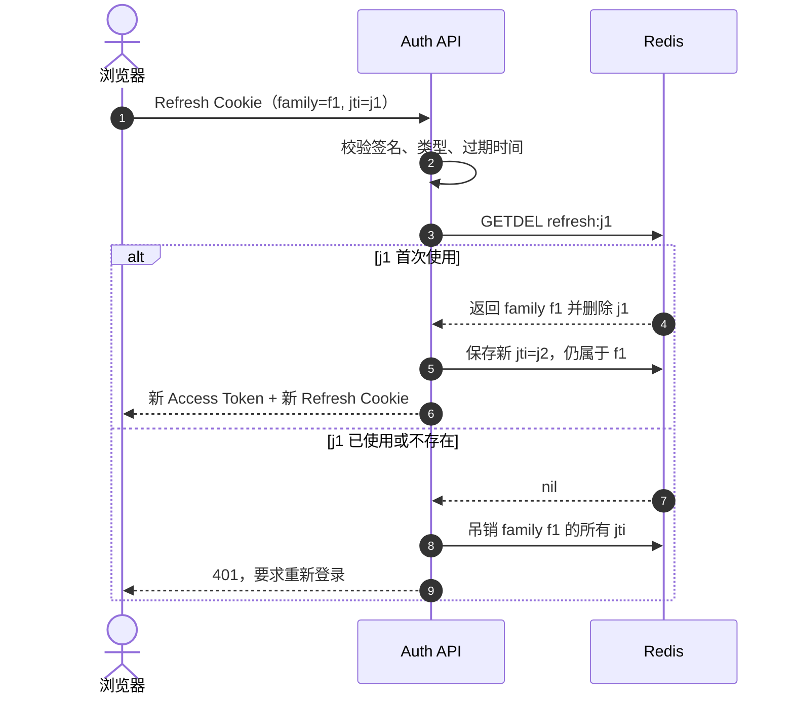

# 企业知识库 RAG：面试项目拷打速成计划

> 适用目标：在 7 天、每天 4～5 小时内，从“能运行项目”提升到“能讲清设计、能顺着代码解释、能承认边界并提出改进”。
>
> 这不是按目录平均学习。时间按面试价值分配：可靠入库 30%，检索与证据 25%，多租户与安全 20%，服务治理 15%，部署前端与其他 10%。

## 一、先记住项目定位

### 30 秒版本

这是一个基于 FastAPI、PostgreSQL/pgvector、Redis、Celery 和 MinIO 的多租户企业知识库。它不只实现“上传文档后向量检索再调用大模型”，重点解决了四个工程问题：用 Transactional Outbox、CAS 和唯一约束保证入库最终可达且重复消费不重复建索引；用向量召回、全文召回、RRF、Parent-Child 和质量门禁保证 RAG 可评估；用 RBAC 加 PostgreSQL RLS 做租户纵深隔离；用 OpenTelemetry、Prometheus、死信和对账任务让链路可观测、可恢复、可审计。

### 90 秒版本

用户上传 PDF、DOCX、Markdown 或 TXT 后，API 一边流式计算 SHA-256 和大小，一边写临时文件，校验扩展名、MIME、文件头和租户配额，再把对象写入 MinIO。随后在同一个 PostgreSQL 事务中写 `documents`、`outbox_events` 和审计日志，避免数据库成功但消息队列失败造成任务永久丢失。

Celery Beat 周期扫描 Outbox，通过 `FOR UPDATE SKIP LOCKED` 抢批次，向 Redis Broker 至少投递一次。Worker 用文档状态和 `processing_token` 做 CAS 抢占；解析、切片、Embedding 分批落盘并刷新心跳；所有新切片写入新的 `index_version`，校验数量后才原子切换 `active_index_version`。因此重复投递只会有一个 Worker 获得执行权，重建失败也不会破坏旧索引。

问答侧先做查询改写和语义缓存，再执行 pgvector HNSW 向量召回与 PostgreSQL `tsvector + GIN` 全文召回，用 RRF 融合，可选 CrossEncoder、Parent-Child 和 Multi-query。检索结果先经过 Prompt Injection 策略和证据门控，生成后再检查引用编号、未引用事实句，并可选做 Claim-Evidence 蕴含校验。租户访问同时受应用层 RBAC 和数据库 RLS 约束。

### 面试时不要说错的三句话

1. 不要说“实现了 exactly-once”。正确说法是：Outbox 和 Celery 都是 at-least-once，业务通过 CAS、稳定任务 ID、唯一约束和状态机获得幂等效果。
2. 不要说“哈希链能阻止所有篡改”。它提供 tamper-evident（篡改可发现）；真正限制普通应用修改的是 `rag_app` 的权限回收和触发器/角色边界。
3. 不要说“引用校验解决了幻觉”。确定性校验只能发现引用越界和部分未引用事实，语义蕴含校验也依赖评审模型，均不是形式化证明。

## 二、按项目重要程度分配精力

下表是针对本仓库的面试准备权重，不是行业统计概率。

| 级别 | 模块 | 准备权重 | 必须能回答到什么程度 | 代码入口 |
|---|---|---:|---|---|
| P0 | 上传、Outbox、Celery、幂等、索引版本 | 30% | 能画时序图，逐个解释宕机窗口和恢复方式 | `app/routers/documents.py:61`、`app/tasks/outbox.py:31`、`app/tasks/ingest.py:142` |
| P0 | 混合检索、RRF、Parent-Child、证据门控 | 25% | 能写 RRF 公式，比较各 profile，并指出当前阈值局限 | `app/services/retriever.py:69`、`:106`，`app/services/evidence.py:140`、`:246` |
| P0 | 多租户、RBAC、RLS、Token、安全审计 | 20% | 能解释纵深隔离、Refresh 重放、WS Ticket、审计哈希链 | `app/deps.py:15`、`app/services/permissions.py:14`、`migrations/versions/0004_enterprise_foundation.py` |
| P1 | FastAPI 异步、SSE、Redis 缓存、LLM 容错 | 15% | 能解释 I/O 与 CPU 边界、流式生命周期、缓存一致性、熔断降级 | `app/routers/chat.py:107`、`app/services/semantic_cache.py:42`、`app/services/llm.py:27` |
| P2 | 评估、测试、可观测、部署、Agent | 10% | 能说明为何指标可信、如何故障注入、固定 RAG 与 Agent 取舍 | `scripts/ci_eval_retrieval.py`、`tests/integration/`、`app/services/agent.py:64` |

如果时间不够，学习顺序必须是：入库可靠性 → 检索 → 租户安全 → 问答服务 → 评估运维 → 前端。

### 2-A、为什么这三个 P0 是面试重点：按源码把“拷打树”展开

#### P0-1 可靠入库（30%）：最容易连续追问 10 分钟

面试官通常不会满足于“我用了 Celery”，而会沿下面的树追问：

```text
上传接口为什么不直接发消息？
  └─ PostgreSQL 和 Redis 双写怎么处理？
      └─ Outbox 会不会重复发布？
          └─ 两个 Worker 同时消费怎么办？
              └─ Worker 半路宕机怎么办？
                  └─ 已写一半向量怎么办？
                      └─ 重建失败为什么旧索引还能查？
                          └─ 用户取消后旧 Worker 会不会继续写？
```

每一层对应一段具体代码，而不是一个中间件名：

| 追问 | 先打开的代码 | 要指出的字段/语句 | 核心结论 |
|---|---|---|---|
| 上传如何落地 | `app/routers/documents.py:82-199` | `written`、`hasher`、`object_key`、`OutboxEvent` | 流式校验；MinIO 先写；DB 三写同事务 |
| Outbox 如何抢任务 | `app/tasks/outbox.py:31-53` | `status`、`next_retry_at`、`with_for_update(skip_locked=True)` | 多 Dispatcher 不抢同一行；租约到期可恢复 |
| 消息如何发布 | `app/tasks/outbox.py:55-118` | `task_id=f"outbox-{event.id}"`、`retry_count` | 至少一次；指数退避；超预算死信 |
| Worker 如何抢占 | `app/tasks/ingest.py:142-176` | `.where(status.in_(...))`、`processing_token`、`.returning()` | CAS 原子抢占，不先查后改 |
| 断点如何复用 | `app/tasks/ingest.py:195-329` | `pipeline_fingerprint`、batch、heartbeat | 只复用相同流水线的已提交批次 |
| 如何原子激活 | `app/tasks/ingest.py:335-375` | `persisted`、`active_index_version`、token 条件 | 完整校验后才切版本，失败仍读旧版 |
| 取消如何生效 | `app/routers/documents.py:286-340` | `processing_token=None`、cancelled | 夺走租约；旧 Worker 后续提交失败 |

零基础学习目标不是背函数名，而是能说出四个不变量：

1. 上传响应成功后，数据库一定保存了文档事实和投递意图。
2. 消息允许重复，但同一时刻只有一个有效 Worker 租约。
3. 一个 Embedding batch 要么连同 heartbeat 一起提交，要么一起回滚。
4. 检索永远只读完整激活版本，不读半成品版本。

#### P0-2 RAG 检索与证据（25%）：区分“调过 API”和“懂质量工程”

典型追问树：

```text
为什么只做向量检索不够？
  └─ 向量分和全文分怎么融合？
      └─ RRF 为什么稳，损失了什么？
          └─ Parent-Child 与 Reranker 各解决什么？
              └─ 无答案问题怎样拒答？
                  └─ 文档里有恶意指令怎么办？
                      └─ 引用编号合法就等于事实正确吗？
                          └─ 参数怎么通过实验确定？
```

| 追问 | 代码入口 | 读代码时圈出的内容 | 面试结论 |
|---|---|---|---|
| RRF | `app/services/retriever.py:69-75` | 双层循环、`rank + 1`、`k=60` | 只按名次融合不同量纲召回器 |
| 全文召回 | `app/services/retriever.py:78-103` | `to_tsquery`、`@@`、`ts_rank` | 精确词/编号是向量召回的补充 |
| 租户与版本过滤 | `app/services/retriever.py:122-148` | membership、active version、quarantine、deleting | 检索相关性之前先保证数据可见性正确 |
| Parent/Reranker | `app/services/retriever.py:190-258` | parent expansion、`_cross_encoder_rerank` | 小块定位、大块补上下文；CrossEncoder 只精排小集合 |
| 间接注入 | `app/services/evidence.py:124-244` | risk、policy、quarantine | 文档是 untrusted data，不是模型指令 |
| 无答案门控 | `app/services/evidence.py:246-287` | chunk count、score、vector similarity | 当前阈值有局限，必须诚实说明 |
| 引用校验 | `app/services/evidence.py:290-380` | citation range、factual lines、entailment | 语法、事实支持、幻觉是不同层次 |
| 完整编排 | `app/routers/chat.py:107-290` | cache、retrieve、gate、SSE、persist | 能从问题讲到首 Token 和最终持久化 |

四个质量概念必须分开：召回率回答“证据有没有被找到”；排序回答“相关证据是否靠前”；answerability 回答“这些证据够不够回答”；faithfulness 回答“生成内容是否被证据支持”。只优化其中一个，不能代表 RAG 总体可靠。

#### P0-3 多租户与安全（20%）：不能只背 JWT

典型追问树：

```text
登录后怎样证明用户能访问这个 KB？
  └─ 每条 SQL 都写 workspace 条件，漏一次怎么办？
      └─ RLS 为什么测试环境看起来没生效？
          └─ 表 owner 与 BYPASSRLS 有什么风险？
              └─ 连接池会不会串 user_id？
                  └─ Refresh Token 被复制如何发现？
                      └─ HttpOnly 是否已经防住 CSRF？
                          └─ 审计哈希链能否防超级管理员重写？
```

| 安全层 | 代码/迁移 | 保护什么 | 不能解决什么 |
|---|---|---|---|
| JWT 认证 | `app/deps.py:15-33` | 确认当前 user；注入 RLS 上下文 | 不自动证明其对任意资源有权限 |
| RBAC | `app/services/permissions.py` | Owner/Admin/Editor/Viewer/Auditor 的动作权限 | 开发者漏调用时不能兜底 |
| RLS | `migrations/versions/0004_*`、`0007_*` | 数据库层过滤跨 workspace 行 | owner/BYPASSRLS 角色可绕过 |
| 角色分离 | `deploy/init-db.sh` | 迁移、API、Worker 使用不同权限 | 错误部署或泄漏高权凭证仍危险 |
| Refresh rotation | `app/services/tokens.py:65-98` | 一次性 jti、复制重放后吊销 family | Redis 不可用时需要 fail-closed 取舍 |
| WS ticket | `app/services/tokens.py:100-118` | 避免长效 Token 进入 URL 日志 | 仍需 TLS、Origin 与授权检查 |
| 审计链 | `app/services/audit.py`、迁移 `0008/0009` | 普通篡改可发现、限制应用修改 | 数据库超级管理员可整体重算，需外部锚定 |

迁移文件精确名称：表中的 `0004_*` 是阶段简称，实际文件为 `migrations/versions/0004_enterprise_foundation.py`；RLS 补充迁移是 `migrations/versions/0007_user_data_rls.py`，审计相关是 `migrations/versions/0008_dead_letters_quarantine_audit_chain.py` 与 `migrations/versions/0009_audit_log_immutability.py`。

面试高分表达是：“我没有把认证、授权和数据隔离混为一谈。JWT 证明身份，RBAC 判断动作，RLS 对可见行兜底，数据库角色确保 API 不能绕过 RLS；Refresh rotation 和审计链又分别处理凭证重放与事后追责。”

#### P1/P2 为什么少花时间但不能不懂

P1 的 FastAPI/SSE/Redis/LLM 容错决定系统在慢依赖和高并发下是否还能服务，常作为 P0 讲完后的扩展题；先掌握 `app/routers/chat.py:73-290`、`app/services/llm.py:27-110`、`app/services/semantic_cache.py`。P2 的测试、评估与可观测用来证明前面所有设计不是口号；不用背每个配置项，但必须能从一个故障窗口指出对应测试、指标和告警。

## 三、先建立一张代码地图

### 写入主链路

```text
POST /api/documents
  app/routers/documents.py:61
  ├─ 流式读取、SHA-256、大小/MIME/magic/quota 校验
  ├─ ObjectStorage.put_file
  └─ 一个 DB 事务
      ├─ documents
      ├─ outbox_events
      └─ audit_logs

Celery Beat 每 2 秒
  app/tasks/outbox.py:31
  ├─ FOR UPDATE SKIP LOCKED
  ├─ publishing 租约
  └─ apply_async(stable task_id)

Celery Worker
  app/tasks/ingest.py:142
  ├─ CAS 抢 processing_token
  ├─ parse → chunk → embed batches → index
  ├─ checkpoint + heartbeat 同事务
  └─ CAS active_index_version = target_version
```

### 读取主链路

```text
POST /api/chat
  app/routers/chat.py:107
  ├─ RBAC 校验与会话历史
  ├─ query rewrite
  ├─ query embedding / semantic cache
  ├─ retrieve
  │   ├─ pgvector cosine distance
  │   ├─ tsvector + GIN + ts_rank
  │   ├─ RRF
  │   ├─ optional reranker
  │   └─ optional parent expansion
  ├─ prompt-injection policy
  ├─ evidence gate
  ├─ LLM SSE stream
  ├─ citation validation / optional entailment
  └─ PostgreSQL 持久化 + Redis history/cache
```

### 安全边界

```text
JWT access token
  → app/deps.py:get_current_user
  → SET LOCAL app.user_id
  → app/services/permissions.py 应用层 RBAC
  → PostgreSQL RLS 数据库层兜底

Refresh token
  → HttpOnly/SameSite Cookie
  → Redis one-time jti
  → family rotation / replay revocation

WebSocket
  → access token 换 60 秒 ticket
  → Redis GETDEL 一次消费
```

## 三-A、零基础必画图：画什么、怎么画、面试时怎么讲

这一节不是让你“欣赏架构图”，而是让你能从一张白纸复原系统。第一次照着成品图临摹，第二次只看“手画步骤”，第三次闭卷完成。所有图都遵守同一规则：

1. 方框画组件或状态，箭头画数据或控制流。
2. 实线表示正常路径，虚线表示失败后的恢复或兜底。
3. 箭头上必须写“传的是什么”，不能只画方向。
4. 遇到事务，要用一个框圈住同一事务里的写操作。
5. 遇到异步链路，要明确谁生产消息、谁投递、谁消费，以及能否重复。

### 图 1：项目全景图——先回答“系统里有什么”

**这张图要回答什么：** 浏览器、API、数据库、对象存储、消息队列、Worker、模型服务分别负责什么；写入链和读取链在哪里分开。

**手画步骤：**

1. 纸中央画 FastAPI，左边画浏览器。
2. FastAPI 右边画 PostgreSQL、Redis、MinIO，强调三者职责不同。
3. Redis 下方画 Celery Worker，旁边画 Beat；Beat 不是处理文档，而是触发 Outbox 扫描。
4. Worker 右边画 Parser、Chunker、Embedding；API 右下画 LLM/Reranker。
5. 用蓝笔画上传链，用绿笔画问答链；没有彩笔就分别标注 W（Write）和 R（Read）。



**60 秒说图话术：** “前端只和 FastAPI 通信。原文件进入 MinIO，结构化业务事实和向量在 PostgreSQL，Redis 只承担 Broker、缓存和一次性凭证，不是文档状态的事实源。上传后的入库通过 Outbox 和 Celery 异步完成；问答则由 API 同步检索、做证据门控，再以 SSE 流式返回。”

**对应源码：** `docker-compose.yml`、`app/main.py`、`app/routers/documents.py:61`、`app/routers/chat.py:107`、`app/tasks/outbox.py:31`、`app/tasks/ingest.py:142`。

### 图 2：上传 + Transactional Outbox 时序图——全项目最高优先级

**这张图要回答什么：** 为什么不在上传接口里直接调用 `celery.delay()`；对象存储、数据库和 Broker 不能做一个 ACID 事务时，项目如何避免永久丢任务。

**手画步骤：**

1. 从左到右画六根生命线：用户、API、MinIO、PostgreSQL、Dispatcher、Redis/Celery。
2. 先画流式读取和校验，再画 MinIO 写入；不要把整个文件先读进内存。
3. 用框圈住 PostgreSQL 中 `Document + OutboxEvent + AuditLog`，标注“同一事务”。
4. 把 Dispatcher 画在事务提交之后，说明发布消息不是请求事务的一部分。
5. 补两条失败线：DB 失败补偿删对象；Broker 失败保留 Outbox 后续重试。



**面试官追问“为什么对象先写？”：** 数据库记录需要一个确定的 `object_key`，但 MinIO 和 PostgreSQL 没有共同事务。这个顺序主动接受“对象可能暂时成为孤儿”，并用补偿删除和孤儿扫描收敛；若数据库先成功而对象最终没写成，用户会看到一条永远无法处理的业务记录，恢复更麻烦。

**对应源码：** 上传事务看 `app/routers/documents.py:61-203`；Outbox 模型看 `app/models.py:245-267`；派发看 `app/tasks/outbox.py:31-135`；孤儿对账看 `app/tasks/maintenance.py`。

### 图 3：Outbox 故障恢复图——逐个说清“在哪儿宕机”

**画法：** 正常路径横着画，所有失败从对应节点向下画；每个失败框必须写“数据库里还剩什么”和“谁来恢复”。



**一句话结论：** Outbox 保证“业务提交后投递意图不会消失”，并不保证只投一次；稳定 task ID 降低重复，真正业务幂等由 Worker CAS、状态机和数据库唯一约束共同保证。

### 图 4：Worker 状态机——谁触发、失败去哪、为什么重复执行没副作用

**手画步骤：**

1. 先只画主干：`uploaded/queued → parsing → chunking → embedding → indexing → ready`。
2. 在第一条边写“CAS 抢占 + 写 processing_token”。
3. 从处理中状态向下画 `failed`，从所有可取消状态画 `cancelled`。
4. 在 `embedding` 旁画循环，表示按 batch 保存 checkpoint 和 heartbeat。
5. 在 `indexing → ready` 上写“token 匹配且原子切 active_index_version”。



**零基础理解 CAS：** 假设两个 Worker 同时抢同一文档。它们都执行类似 `UPDATE documents SET processing_token=:my_token WHERE id=:id AND status IN (...) RETURNING id`。数据库只会让第一个满足旧条件的更新成功；第二个执行时状态或 token 已变，`RETURNING` 为空，于是直接退出。它不是“先查再改”，而是把检查和修改放在一条原子 SQL 里。

**对应源码：** 状态枚举在 `app/models.py:44`；抢占在 `app/tasks/ingest.py:142-176`；阶段切换 `_set_stage` 在 `app/tasks/ingest.py:76`；心跳 `_touch_heartbeat` 在 `app/tasks/ingest.py:90`；取消在 `app/routers/documents.py:286`。

### 图 5：索引版本切换图——为什么重建时旧索引仍可查询



**面试讲法：** “这相当于应用层的蓝绿索引。新版本没有完成前，`active_index_version` 仍指向 v1，检索过滤条件不会读到半成品 v2。只有全部写完并核对数量，Worker 才用带 `processing_token` 的 CAS 原子切换。失败影响新版本构建，不影响旧版本在线查询。”

**对应源码：** `Document.active_index_version/target_index_version` 在 `app/models.py:183-184`；Chunk 唯一约束在 `app/models.py:209-243`；激活在 `app/tasks/ingest.py:345-369`；查询过滤在 `app/services/retriever.py:125`。

### 图 6：从问题到第一个 Token 的 RAG 全链路图

**手画步骤：**

1. 左侧画问题进入 `/api/chat`，先经过认证、RBAC 和历史读取。
2. 中间画查询改写、Embedding、语义缓存；缓存命中可提前返回。
3. 把检索画成两条并行支路：向量和全文，汇合到 RRF。
4. RRF 后按实际顺序画 Parent 扩展和可选 Reranker，再画 Injection Policy 与 Evidence Gate。
5. 最后画 LLM、SSE、引用校验、独立 Session 持久化；注意引用校验发生在流末尾。



**必须主动说明的边界：** 当前实现先把 LLM delta 流给客户端，结尾才校验引用并可能发送 replacement，所以它依赖前端正确覆盖旧文本，不等同于“生成前阻断”。高安全模式应先缓冲、校验，再输出。

**对应源码：** `app/routers/chat.py:107-290`、`app/services/retriever.py:106-238`、`app/services/evidence.py:140-287`、`app/services/evidence.py:300`、`app/services/llm.py`。

### 图 7：混合检索与 RRF——公式应该写在图旁边



取 `k=60` 时：

```text
B = 1/(60+2) + 1/(60+1) = 0.03252
A = 1/(60+1) + 1/(60+3) = 0.03227
C = 1/(60+3)               = 0.01587
D = 1/(60+2)               = 0.01613
```

**为什么不用原始分数直接相加：** pgvector 返回的余弦距离/相似度与 PostgreSQL `ts_rank` 的分布、上下界和含义不同，直接相加必须额外归一化和调权。RRF 放弃分数幅度，只看每一路排名，因此对不同召回器更稳健；代价是丢失“第一名比第二名强很多”这类幅度信息。

### 图 8：RBAC + RLS 纵深隔离图——安全题必画

**手画步骤：** 画四道门：身份认证、资源权限、数据库行策略、后台角色边界。面试时不要把 RBAC 和 RLS 说成重复实现，它们处理的故障面不同。



**标准答案：** RBAC 提供业务语义，例如 Viewer 能读不能写、Auditor 能看审计却不能问答；RLS 是数据库兜底，即使应用开发者漏写 `workspace_id` 过滤，非 owner 的 `rag_app` 仍拿不到跨租户行。`SET LOCAL` 的用户上下文只在当前事务有效，连接归还连接池后不会污染下一请求。

**对应源码：** `app/deps.py:15-33`、`app/services/permissions.py`、`migrations/versions/0004_enterprise_foundation.py`、`migrations/versions/0007_user_data_rls.py`、`deploy/init-db.sh`。

### 图 9：Refresh Token 轮换与重放检测图



**零基础解释：** Refresh Token 像只能撕一次的换票券。`GETDEL` 把“检查存在”和“删除”做成 Redis 原子操作；如果旧票再次出现，系统推断它可能已被复制，于是吊销整个 family。HttpOnly 只阻止 JavaScript 读取 Cookie，不能单独防 CSRF，还需要 SameSite、Origin/Referer 校验和 HTTPS Secure Cookie。

**对应源码：** `app/services/tokens.py:18-118` 与认证路由。

### 图 10：五张图的闭卷验收顺序

真正面试前，至少闭卷画出下面五张。每张限时 3 分钟，画完再用 60 秒讲解：

1. 图 2：上传与 Outbox 时序图。
2. 图 3：Outbox 故障窗口图。
3. 图 4：Worker 状态机。
4. 图 6：RAG 查询链路图。
5. 图 8：RBAC + RLS 纵深隔离图。

评分方法：组件齐全 2 分、箭头数据写清 2 分、事务边界 2 分、失败恢复 2 分、能指向源码 2 分；低于 8 分就再临摹一次。

## 三-B、零基础代码逐文件精讲：从“看不懂”到能顺着讲

### 先补 12 个最小概念

| 词 | 零基础解释 | 本项目里的例子 |
|---|---|---|
| Router | 接收 HTTP 请求、校验参数、组织响应的入口 | `app/routers/documents.py`、`chat.py` |
| Service | 可复用的业务能力，不直接决定 HTTP 状态码 | `retriever.py`、`evidence.py`、`llm.py` |
| Model | Python 类与数据库表的映射 | `app/models.py` 的 `Document`、`Chunk` |
| Session | 一次与数据库交互的工作上下文 | FastAPI 用 `AsyncSession`，Celery 用同步 Session |
| Transaction | 一组数据库操作要么全部成功，要么全部回滚 | 上传时同时写 Document、Outbox、Audit |
| CAS | 只有旧状态仍符合条件才更新成功 | Worker 抢 `processing_token` |
| Outbox | 把“要发消息”先作为业务数据写进数据库 | `outbox_events` 表 |
| Broker | 暂存并投递异步任务的通道 | Redis 给 Celery 使用 |
| Chunk | 从文档切出、可单独检索的一小段文本 | `chunks` 表 |
| Embedding | 把文本变成向量，使语义接近的文本距离更近 | BGE Embedder + pgvector |
| RRF | 只按多路排名融合结果的算法 | `rrf_fuse` |
| RLS | 数据库根据当前用户自动过滤行 | PostgreSQL policy + `app.user_id` |

### 文件阅读总顺序：不要从第一行漫无目的地读

| 顺序 | 文件 | 先找什么 | 读完必须能说什么 |
|---:|---|---|---|
| 1 | `app/models.py` | `DocStatus`、`Document`、`Chunk`、`OutboxEvent` | 系统保存了哪些事实和不变量 |
| 2 | `app/routers/documents.py` | `upload_document` | 一次上传如何跨 MinIO、DB、Outbox |
| 3 | `app/tasks/outbox.py` | `dispatch_outbox_batch` | DB 里的投递意图怎样进入 Broker |
| 4 | `app/tasks/ingest.py` | `ingest_document` | Worker 如何抢占、断点续跑、激活版本 |
| 5 | `app/services/retriever.py` | `retrieve`、`rrf_fuse` | 向量和全文如何过滤、融合、重排 |
| 6 | `app/routers/chat.py` | `chat`、`event_stream` | 检索、门控、LLM、SSE 如何串起来 |
| 7 | `app/services/evidence.py` | 三道函数 | 如何处理间接注入、无答案和引用 |
| 8 | `app/deps.py`、`permissions.py` | 用户上下文和权限判断 | RBAC + RLS 怎样形成双层防线 |
| 9 | `app/services/tokens.py` | `rotate_refresh_token` | 一次性 jti 与 family 重放吊销 |
| 10 | 测试与迁移 | 集成测试断言、RLS policy | 设计不是口号，如何被验证 |

### 文件 1：`app/models.py`——先看数据，再看流程

#### `Document` 是整个入库状态机的“控制面”

重点字段按用途分组记忆：

- 身份与归属：`id`、`kb_id`、`owner_id`，回答“这是谁的哪份文档”。
- 对象事实：`object_key`、`filename`、`content_hash`、`size_bytes`，回答“原文件放哪、内容是否相同”。
- 执行状态：`status`、`processing_token`、`processing_heartbeat_at`，回答“谁正在处理、租约是否还新鲜”。
- 版本控制：`active_index_version`、`target_index_version`、`pipeline_fingerprint`，回答“线上读哪个版本、正在建哪个版本、旧 checkpoint 能否复用”。
- 安全与运维：`quarantined`、错误和重试相关字段，回答“能不能被检索、失败到了哪一步”。

零基础读法：每看到一个字段，都问三个问题——谁写它、谁读它、并发时什么约束保护它。例如 `active_index_version` 由 Worker 激活阶段写，由 Retriever 每次查询读，写入受 `processing_token` CAS 保护。

#### `Chunk` 是检索的数据面

一个 Chunk 至少包含正文、顺序号、页码/父段信息、Embedding、全文检索向量和 `index_version`。`UNIQUE(document_id, seq, index_version)` 的意义是：同一文档同一版本不能重复插入第 7 块，但 v1 的第 7 块与 v2 的第 7 块可以共存，从而支持零停机重建。

#### `OutboxEvent` 是可靠投递意图

把它当成一张数据库内任务单：`aggregate_id` 指向文档，`event_type/payload` 说明要做什么，`status` 表示 pending/publishing/sent/failed，`retry_count` 和 `next_retry_at` 控制重试。它的存在说明“业务已经提交，并承诺最终尝试投递”。

**自测题：为什么 Redis 里有 Celery 消息还不够？**

**答案：** 因为 API 同时要提交 PostgreSQL 业务状态和向 Redis 发消息，两次写之间一定存在宕机窗口。Redis 消息不是数据库事务的一部分；Outbox 把业务状态和投递意图放进同一个 PostgreSQL 事务，消除“Document 已成功但系统完全不知道还要发任务”的永久丢失。

### 文件 2：`app/routers/documents.py:61-203`——一次上传逐步走读

把 `upload_document` 按七段读，不必一开始理解每个 Python 语法：

1. **鉴权与权限。** FastAPI 依赖先拿到当前用户，再验证其对目标知识库是否有上传权限。
2. **流式落临时文件。** 循环读取约 1MB；同一遍累计字节数、截取文件头、更新 SHA-256，避免整个大文件常驻内存。
3. **内容校验。** 扩展名/MIME 是外层检查，magic header 是内容特征检查；三者都不能当杀毒软件，但能挡住明显伪装。
4. **配额检查。** 查询 workspace 已使用大小与上限。要主动承认当前“先 SUM 后 INSERT”在并发上传下存在竞态，改进见 Day 6。
5. **写对象存储。** 使用确定的 `object_key` 把临时文件写入 MinIO。
6. **写数据库事务。** 同时创建 `Document`、`OutboxEvent`、`AuditLog`，任何一个失败都回滚。
7. **清理与补偿。** DB 失败时删已上传对象；无论成功失败都在 `finally` 清临时文件。进程级崩溃留下的孤儿由维护任务扫描。

输入是“用户、知识库 ID、上传文件”，正常输出是“带 `document_id` 的已接收响应”；它并不等待解析和 Embedding 完成。这个区分很重要：HTTP 上传成功表示文件与任务意图已可靠落库，不表示文档已经 `ready`。

**面试官让你指代码时：** 先指函数入口，再按“流式读 → MinIO → DB 三写 → except 补偿 → finally 清理”移动，不要从 import 开始逐行念。

### 文件 3：`app/tasks/outbox.py:31-135`——为什么可以多实例并发扫描

`dispatch_outbox_batch` 可以拆成“领取、发布、回写”三步：

1. **领取：** 查询到期的 pending，以及租约已过期的 publishing；`FOR UPDATE SKIP LOCKED` 让一个 Dispatcher 锁住的行被其他实例跳过，而不是互相等待。
2. **发布：** 先把行标成 publishing 并记录租约，再调用 Celery `apply_async`；任务 ID 由事件稳定派生，所以同一事件重试使用同一 ID。
3. **回写：** 成功则 sent；失败则增加 `retry_count`，按指数退避设置 `next_retry_at`；超预算写死信并标 failed。

**为什么不是一整个事务包住网络发布？** 数据库事务无法让 Redis 发布参与原子提交；若持锁等待网络还会延长事务、增加竞争。设计目标不是消除重复，而是让 pending 意图可恢复，并让消费端承受重复。

### 文件 4：`app/tasks/ingest.py:142-481`——全项目最值得精读的函数

按 token 生命周期把函数切成六段：

1. **生成 token。** 每次 Worker 尝试都有自己的 `processing_token`，相当于本轮租约身份证。
2. **CAS 抢占。** 只有允许处理的状态、超时租约或明确重试条件满足时才更新成功；拿不到就说明已有别人处理或任务已失效，当前消息安全退出。
3. **解析与切片。** 从对象存储下载，Parser 产生带页码/段落的文本，Chunker 根据配置切块，计算 `pipeline_fingerprint`。
4. **Embedding checkpoint。** 每批 Chunk 和向量落库时，同事务刷新 heartbeat。若 token 已被取消任务清掉，带 token 条件的更新失败，整批回滚并抛 `LeaseLostError`。
5. **版本激活。** 核对目标版本 Chunk 数量后，执行带 `processing_token` 的条件更新，把 `active_index_version` 指向 target，并清 token。
6. **异常分类。** 暂时性错误交给 Celery 有预算地重试；格式不支持等不可重试错误直接失败；超过预算写 `DeadLetterTask`，不能无限重试拖垮系统。

这里有三层幂等，不要只说一种：

- 消息层：stable task ID 降低重复调度，但不能当最终保证。
- 状态层：Document CAS 只允许一个有效 token 推进状态。
- 数据层：Chunk 唯一约束阻止同版本同序号重复写入。

**自测题：Worker 写完第 3 批向量后宕机，重投时从哪开始？**

**答案：** 若 `pipeline_fingerprint` 未变化，已经在事务中提交的批次可作为 checkpoint 复用，后续从未完成批次继续；正在写但未提交的那一批会整体回滚。若切片配置、内容哈希或 Embedding 模型改变导致 fingerprint 变化，则不能盲用旧 checkpoint，应构建新目标版本。

### 文件 5：`app/services/retriever.py:36-258`——检索不是一句“查向量库”

先看数据类 `RetrievedChunk`，它是检索层统一结果；再看三个核心阶段：

1. **向量召回。** 用 Query Embedding 与 pgvector 列计算余弦距离，取 top-k。
2. **全文召回。** 提取并清洗关键词，构造 `to_tsquery`，通过 `tsvector + GIN` 匹配并用 `ts_rank` 排序。
3. **融合与增强。** `rrf_fuse` 按各路名次加分；根据 profile 做父段扩展或 CrossEncoder 重排。

任何召回 SQL 都不能漏掉业务过滤：用户必须属于 workspace、Chunk 版本必须等于 Document 当前激活版本、文档不能处于隔离/删除流程，若指定知识库还要限制 `kb_id`。应用层条件用于清晰与性能，RLS 继续做数据库兜底。

**Reranker 与 Embedding 的根本区别：** Embedding 是双塔结构，查询和文档分别编码，文档向量可以预计算，适合从大量文档快速召回；CrossEncoder 把“查询 + 候选文档”一起输入模型，交互更充分但每个候选都要计算，适合对小候选集精排。

### 文件 6：`app/routers/chat.py:107-290`——一次问答逐步走读

读这个函数时找出两个阶段：返回 `StreamingResponse` 之前的准备阶段，以及异步生成器真正执行的流式阶段。

准备阶段依次做权限校验、会话历史、查询改写、查询向量、语义缓存与检索。查询向量会复用于缓存相似度和向量召回，避免无意义重复计算。检索后先做间接 Prompt Injection 策略，再做证据门控；证据不足时不调用 LLM，直接给确定性拒答。

流式阶段把检索来源包装在 `<untrusted_document>` 边界内交给 LLM，逐个 delta 发送 SSE。完成后做引用编号/事实句检查，可选做蕴含验证，然后用独立数据库 Session 写入问题和回答，并更新 Redis 历史/语义缓存。独立 Session 是因为流可能持续较久，不能假定请求依赖注入的 Session 一直适合后续提交。

**第一 Token 前发生了什么：** 认证、权限、历史读取、改写、Embedding、缓存查询、向量/全文检索、RRF、可选增强、注入策略、证据门控、Prompt 构造、LLM 建连。优化首 Token 延迟时要按 span 分段测量，而不是只盯模型时间。

### 文件 7：`app/services/evidence.py`——三道不同目的的安全门

1. `apply_injection_policy` 处理的是**文档是否包含可疑指令**：标记、降权或移除 Chunk，必要时隔离。
2. `assess_evidence` 处理的是**现有证据够不够回答**：看候选数量与融合分数，证据不足则拒答。
3. `validate_citations` 处理的是**答案是否按约定引用来源**：检查引用编号越界和部分未引用事实句。

三者不能互相替代。一个没有注入的文档也可能与问题无关；证据相关也不保证模型每句话都有引用；引用编号合法也不证明引用内容真的支持那句话。

**当前实现必须诚实说明：** `assess_evidence` 虽计算 `top_vector_similarity`，主要门槛仍是数量与当前 `score`。Rerank 后 `score` 语义还可能从 RRF 分变成 CrossEncoder 分，却继续被类似阈值使用。因此后续应拆分 `rrf_score/rerank_score/final_score`，按 profile 在固定评估集上校准绝对相似度与 no-answer 阈值。

### 文件 8：`app/deps.py` + `app/services/permissions.py`——认证、授权、隔离不是一回事

- 认证回答“你是谁”：解码 JWT，得到当前 User。
- 授权回答“你能做什么”：根据 WorkspaceMembership 的角色检查 read/upload/manage/audit 等动作。
- 隔离回答“即便代码漏写条件，数据库给你哪些行”：`SET LOCAL app.user_id` 后由 RLS policy 自动过滤。

为什么资源无权限常返回 404：如果返回 403，攻击者可根据差异判断某个其他租户的文档 ID 是否存在；统一成 404 减少资源枚举信息。

### 文件 9：测试——把“我觉得可靠”变成可验证不变量

精读测试时不要只看 Arrange/Act/Assert 语法，要把测试名翻译成一句不变量：

- `test_outbox_dispatch_is_at_least_once_and_idempotent`：允许重复投递，但最终业务效果不重复。
- `test_ingestion_version_switch_and_duplicate_delivery`：重复消息不破坏状态，激活只指向完整版本。
- `test_postgresql_rls_blocks_cross_tenant_rows`：非 owner 应用角色直接 SQL 也读不到别租户行。
- `test_index_activation_failure_leaves_old_version_queryable`：v2 激活失败时 v1 仍在线。
- `test_embedding_partial_checkpoint_resume`：已提交批次可恢复，未提交批次不留下半状态。
- `test_sse_chat_streaming_end_to_end`：事件顺序、流式输出与持久化在真实依赖下协同工作。

面试里最有说服力的表述是：“这个机制保护的不变量是 X，我用 Y 故障注入，在 Z 断言了它”，而不是只说“项目有很多测试”。

### 五段关键代码逐行拆解：第一次读 Python/SQLAlchemy 就照这个方法

在原“五段关键代码”基础上，本次额外增加了第 6 段 RLS 上下文，因此下面实际共有六段；原有标题保留，新增段落用于把安全主线讲完整。

下面片段保留项目真实写法，只截取关键行。先读左边代码，再读下面逐行解释，最后合上文档自己复述。

#### 片段 1：上传为什么不会把大文件一次塞进内存

来自 `app/routers/documents.py:82-102`：

```python
staging_path = make_staging_file(extension)
max_bytes = settings.max_upload_mb * 1024 * 1024
written = 0
header = b""
hasher = hashlib.sha256()

async with aiofiles.open(staging_path, "wb") as output:
    while chunk := await file.read(1024 * 1024):
        if not header:
            header = chunk[:16]
        written += len(chunk)
        if written > max_bytes:
            raise HTTPException(413, "文件过大")
        hasher.update(chunk)
        await output.write(chunk)
```

- `await` 表示等待磁盘/网络 I/O 时让事件循环服务其他请求。
- `:=` 是“赋值表达式”：读取一块并把它放入 `chunk`；读到空字节时循环结束。
- 每次只读 `1024 * 1024` 字节，即约 1MB；100MB 文件不会直接产生一个 100MB Python bytes。
- `header` 只保留第一块前 16 字节，用于 magic 校验；扩展名可以伪造，文件头增加一道检查。
- `hasher.update(chunk)` 边读边计算 SHA-256，无需再完整读一遍文件。
- `written` 同时用于大小限制和租户配额。它保护单文件限制，但 workspace 并发配额仍有 Day 6 所述竞态。

复述答案：“这里把落盘、计数、哈希和文件头截取合并成一次流式扫描，空间复杂度接近一个 batch，而不是文件大小。”

#### 片段 2：`FOR UPDATE SKIP LOCKED` 到底在代码哪一行

来自 `app/tasks/outbox.py:34-53`：

```python
events = list(
    db.execute(
        select(OutboxEvent)
        .where(
            OutboxEvent.status.in_([pending, publishing]),
            OutboxEvent.next_retry_at <= now,
        )
        .order_by(OutboxEvent.created_at)
        .limit(settings.outbox_batch_size)
        .with_for_update(skip_locked=True)
    ).scalars()
)
for event in events:
    event.status = OutboxStatus.publishing
    event.next_retry_at = now + timedelta(seconds=60)
db.commit()
```

- `select(OutboxEvent)` 对应 SQL 的 `SELECT ... FROM outbox_events`。
- `.where(...)` 只拿 pending 或可恢复的 publishing，并要求到达下次重试时间。
- `.order_by(created_at).limit(batch_size)` 让旧事件优先且一次不扫爆数据库。
- `.with_for_update(skip_locked=True)` 对选中行加排他锁；其他 Dispatcher 跳过已锁行去处理下一批。
- 先写 publishing 与 60 秒租约再提交。Dispatcher 若随后崩溃，事件不会永久卡死，租约到期后可再次被扫描。

复述答案：“数据库行锁负责同一时刻的领取互斥，`next_retry_at` 负责领取者死亡后的租约恢复；两者解决的是不同问题。”

#### 片段 3：Worker CAS 不是口号，是一条条件 UPDATE

来自 `app/tasks/ingest.py:142-176`：

```python
token = uuid.uuid4().hex
claimed_id = db.execute(
    update(Document)
    .where(
        Document.id == document_id,
        Document.status.in_([uploaded, queued, retrying]),
    )
    .values(
        status=DocStatus.parsing,
        processing_token=token,
        heartbeat_at=now,
    )
    .returning(Document.id)
).scalar_one_or_none()
db.commit()

if claimed_id is None:
    return {"ok": False, "reason": "already claimed or invalid status"}
```

- `UPDATE ... WHERE status IN (...)` 把“检查旧状态”和“写新状态”放进数据库的一次原子操作。
- `.returning(Document.id)` 只有更新成功才返回 ID；没有返回就表示当前消息不再拥有执行资格。
- `processing_token` 不只是日志 ID。后续阶段更新、heartbeat 和最终激活都必须带同一个 token 条件，它是 fencing token/租约所有权证明。
- 两个 Worker 并发时，不会先各自 SELECT 后都以为能做；数据库决定谁的条件更新先成功。

复述答案：“CAS 保护控制面，唯一约束保护数据面；只做其中一个都不如两层一起稳。”

#### 片段 4：索引激活为什么是原子的

来自 `app/tasks/ingest.py:335-375`：

```python
persisted = db.execute(
    select(func.count()).select_from(Chunk).where(
        Chunk.document_id == document.id,
        Chunk.index_version == target_version,
    )
).scalar_one()

if persisted != len(pieces):
    raise RuntimeError("chunk count mismatch before activation")

switched = db.execute(
    update(Document)
    .where(
        Document.id == document_id,
        Document.processing_token == token,
        Document.status == DocStatus.indexing,
    )
    .values(
        status=DocStatus.ready,
        active_index_version=target_version,
        target_index_version=None,
        processing_token=None,
    )
    .returning(Document.id)
).scalar_one_or_none()
```

- 第一段先验证目标版本实际持久化数量与预期切片数相等，防止半索引上线。
- 第二段只有“文档正确 + token 仍属于我 + 正处于 indexing”同时成立才切换。
- active 指针、ready 状态、清 target 和清 token 在同一条 UPDATE 中变化，其他查询看不到一半更新。
- `switched is None` 表示租约已丢或状态被取消，旧 Worker 必须失败退出，不能“好心”把自己结果上线。

#### 片段 5：RRF 的四行代码怎样对应数学公式

来自 `app/services/retriever.py:69-75`：

```python
def rrf_fuse(rankings: list[list[str]], k: int = 60) -> dict[str, float]:
    scores: dict[str, float] = {}
    for ranking in rankings:
        for rank, chunk_id in enumerate(ranking):
            scores[chunk_id] = scores.get(chunk_id, 0.0) + 1.0 / (k + rank + 1)
    return scores
```

- 外层循环遍历向量榜、全文榜以及 multi-query 产生的额外向量榜。
- `enumerate` 默认从 0 开始，所以公式分母用 `rank + 1` 转为人类的一号名次。
- `scores.get(chunk_id, 0.0)` 表示第一次出现从 0 分开始；同一 Chunk 在另一榜再次出现就累加。
- 最后还要按 value 降序排列；这个函数只负责算融合分。

手算时写 `1/(60+名次)`，读代码时看到的是 `1/(60+零基下标+1)`，两者完全一致。

#### 片段 6：RLS 用户上下文为什么不会在连接池里串用户

来自 `app/deps.py:15-31`：

```python
user_id = decode_access_token(credentials.credentials)
user = (
    await db.execute(select(User).where(User.id == user_id))
).scalar_one_or_none()

await db.execute(
    text("SELECT set_config('app.user_id', :user_id, true)"),
    {"user_id": user.id},
)
```

- JWT 解码先得到身份，再确认数据库中用户仍存在，不能只信一个已经删除用户的旧 Token。
- SQL 使用参数 `:user_id`，不是字符串拼接，避免把用户输入当 SQL 代码。
- `set_config` 第三个参数为 `true`，表示 transaction-local；提交/回滚后自动失效。
- RLS policy 读取 `current_setting('app.user_id', true)`，让数据库知道本事务代表谁。

注意：只有真正通过 Alembic 迁移安装 policy，并使用非 owner、无 `BYPASSRLS` 的 `rag_app`，这段上下文才形成实际隔离。只运行 ORM `create_all` 并不能证明 RLS 已启用。

## 四、7 天速成安排

| 天 | 主题 | 预计时间 | 当天必须产出 |
|---|---|---:|---|
| Day 0 | 环境、目录和基线 | 2h | 项目跑通；手画两条主链路 |
| Day 1 | 上传与可靠异步入库 | 5h | 能完成 5 分钟 Outbox 深挖 |
| Day 2 | RAG 检索与生成防线 | 5h | 能手算 RRF；能解释 5 种 profile |
| Day 3 | 多租户、认证与安全 | 4.5h | 能画 RBAC+RLS；能讲 Token replay |
| Day 4 | FastAPI、缓存与 LLM 容错 | 4h | 能解释异步边界、SSE、缓存失效和熔断 |
| Day 5 | 测试、评估、可观测与部署 | 4h | 能解释质量门禁和 3 个故障注入用例 |
| Day 6 | 缺陷审视与改进设计 | 4h | 准备 8 个“不足—影响—改法—验证”答案 |
| Day 7 | 三轮模拟拷打 | 4h | 30 秒、2 分钟、5 分钟三档话术稳定输出 |

---

## Day 0：跑通项目，只建立骨架

### 第 1 步：读文档，不钻实现（30 分钟）

依次读：

1. `README.md`：只记四个项目目标、技术栈、两条链路。
2. `docs/架构设计.md`：重点看上传时序、Worker CAS、索引版本、隔离边界。
3. `docker-compose.yml`：把 PostgreSQL、Redis、MinIO、API、Worker、Beat 的职责写在纸上。

读完后闭卷回答：

- PostgreSQL 是业务事实来源；Redis 只是 Broker、缓存和实时通知，不是文档状态事实来源。
- API 和对象存储无法组成单个 ACID 事务，所以使用补偿删除和孤儿对象对账。
- DB 与 Broker 双写通过 Transactional Outbox 解决。

### 第 2 步：启动与冒烟（45 分钟）

```powershell
Copy-Item .env.example .env
# 修改 .env 中所有 change-me，不要把真实密钥提交到 Git
docker compose up -d --build
docker compose ps
docker compose logs --tail 100 api worker beat
Invoke-RestMethod http://localhost:8000/api/health
```

不要只看“容器 Up”。`/api/health` 只确认 API、PostgreSQL 和 Redis；MinIO、Embedding 与 LLM 还要通过
实际上传/问答和日志单独冒烟。健康接口不返回原始异常，是为了避免泄露连接串或内部拓扑，见
`app/main.py:131`。

### 第 3 步：建立验证基线（45 分钟）

```powershell
ruff check app tests scripts
pytest -q
```

再浏览测试名称：

```powershell
rg -n "^def test_|^async def test_" tests
```

当天验收：不用看文档，画出“浏览器 → API → MinIO/PostgreSQL → Outbox → Redis → Worker → PostgreSQL”的图，并说明每条箭头的数据是什么。

零基础临摹指引：先照“三-A 图 1”画组件位置，再照“图 2”补事务与箭头数据；第一次允许看图，第二次只看手画步骤，第三次闭卷。标准答案中，浏览器到 API 是文件/问题，API 到 MinIO 是原文件，API 到 PostgreSQL 是 Document + Outbox + Audit，Dispatcher 到 Redis 是任务消息，Worker 回 PostgreSQL 是状态、Chunk、Embedding 和激活版本。

---

## Day 1：吃透最重要的可靠入库

### 1.1 上传入口（60 分钟）

精读 `app/routers/documents.py:61-203`，按下面顺序给代码写旁注：

1. 文件扩展名与 MIME 白名单。
2. 1MB 一批读取，避免整文件进入内存。
3. 同时累计大小、截取 magic header、计算 SHA-256。
4. 工作区配额检查。
5. 先写对象存储，再开启业务数据落库。
6. 同一 DB 事务加入 `Document`、`OutboxEvent`、`AuditLog`。
7. DB 提交失败时补偿删除对象；进程在补偿前崩溃则靠孤儿扫描。
8. 临时文件在 `finally` 删除。

必须回答：为什么对象存储先写？因为数据库记录需要一个确定的 `object_key`，而 S3 和 PostgreSQL 没有共同事务。这个顺序选择了“对象可能暂时成为孤儿”，再用补偿和对账收敛；反过来会产生数据库已有记录但对象不存在的问题。

### 1.2 Transactional Outbox（75 分钟）

精读：

- 模型：`app/models.py:245-271`
- 生产事件：`app/routers/documents.py:136-174`
- 调度：`app/tasks/outbox.py:31-135`
- Beat：`app/tasks/__init__.py`

把故障矩阵背熟：

| 故障窗口 | 会发生什么 | 如何恢复 |
|---|---|---|
| DB 事务回滚 | Document、Outbox、Audit 都不存在 | API 删除已上传对象 |
| DB 提交后 Broker 挂 | Outbox 保持 pending | Beat 以后指数退避重试 |
| Dispatcher 抢到后崩溃 | 事件暂留 publishing | `next_retry_at` 到期后重新扫描 |
| 消息发布成功、标 sent 前崩溃 | 可能重复发布 | 稳定 task ID 辅助，真正兜底是 Worker CAS |
| 超过 Outbox 重试预算 | 标记 failed | 写 `dead_letter_tasks`，管理员重放 |

八股连接：

- `FOR UPDATE SKIP LOCKED`：多 Dispatcher 实例不会等待同一批行；被其他事务锁住的行直接跳过，适合队列式批处理。
- 指数退避：减少故障期间对 Broker 的持续冲击；代码上限 300 秒。
- Outbox 解决的是“业务状态和投递意图同事务”，不保证消息只投递一次。

### 1.3 Worker 状态机、CAS 与幂等（90 分钟）

精读 `app/tasks/ingest.py:142-481`，用 token 的生命周期串代码：

1. Worker 生成 `processing_token`。
2. 单条 `UPDATE ... WHERE status IN (...) RETURNING id` 抢占。
3. 后续 `_set_stage`、`_touch_heartbeat`、最终激活都必须匹配 token。
4. 用户取消、删除或对账任务可以清掉 token；旧 Worker 下次写入时得到 `LeaseLostError`。
5. `acks_late=True` 和 `reject_on_worker_lost=True` 保证 Worker 异常退出后 Broker 可重投。
6. 重投并不可怕；状态 CAS 和 `UNIQUE(document_id, seq, index_version)` 让重复执行无副作用。

面试标准答案：这不是传统分布式锁。锁的事实状态在文档行上，抢占和状态变更由数据库条件更新完成；token 是租约所有权证明，心跳用于判断租约是否陈旧。

### 1.4 Checkpoint 和零停机重建（60 分钟）

精读 `app/tasks/ingest.py:224-385` 与模型 `app/models.py:179-234`。

要能讲清：

- `pipeline_fingerprint = hash(content_hash + chunk config + embedding model)`，只有流水线未变化时才复用旧断点。
- 每一 Embedding batch 把 Chunk 与 heartbeat 放在同一事务提交；如果 token 已失效，整批回滚。
- 新版本 Chunk 全部写完并核对数量后，才在一次 CAS 中设置 `active_index_version=target_version`。
- 检索始终要求 `Chunk.index_version == Document.active_index_version`，所以构建 v2 时仍读取 v1。

当天动手题：给 `ingest_document` 画出 uploaded → queued → parsing → chunking → embedding → indexing → ready 状态机，并在每条边标出“谁触发、事务边界、失败去向”。

画图标准答案直接参照“三-A 图 4”：主干必须包含七个状态，旁路必须包含 failed/cancelled；`queued → parsing` 标 CAS 抢 `processing_token`，`embedding` 标 batch checkpoint + heartbeat 同事务，`indexing → ready` 标核对数量并 CAS 切 `active_index_version`。少了这三个注释，即使状态名画全也只能算背流程，不能算理解并发与故障恢复。

当天拷打题：

1. 为什么不能让上传接口直接 `celery.delay()`？

   **参考答案：** 因为数据库提交与向 Redis Broker 发消息是两个独立操作，不能共享 ACID 事务。若先提交 DB 后 `delay()`，进程可能在两者之间宕机，Document 已存在但任务永久丢失；若先发消息后提交 DB，Worker 又可能先消费到一条尚不存在或随后回滚的 Document。项目把 `Document` 与 `OutboxEvent` 放在同一 DB 事务，之后由 Dispatcher 重试发布，把“永久丢投递意图”变成“允许重复但最终可达”。代码对应 `app/routers/documents.py:136-174` 与 `app/tasks/outbox.py:31-135`。

2. Celery 的 stable task ID 能否代替业务幂等？为什么不能？

   **参考答案：** 不能。stable task ID 只是消息标识，Broker/Backend 的去重行为、保存周期和故障恢复不能替代业务不变量；同一个任务仍可能因确认丢失、Worker 宕机或 Outbox 重发而再次执行。业务幂等由三层兜底：Document 状态 + `processing_token` 的 CAS、Chunk 的 `UNIQUE(document_id, seq, index_version)`、版本激活条件更新。即使消息真的执行两次，最终数据库状态也不应重复或倒退。

3. Worker 在 Embedding 完成但激活索引前宕机，旧索引还能查吗？

   **参考答案：** 能。新 Chunk 写入 `target_index_version`，但 Retriever 始终过滤 `Chunk.index_version == Document.active_index_version`。激活前 `active_index_version` 仍是 v1，因此用户继续查询完整的 v1；只有 v2 全部写完、数量核对通过并且 token 仍匹配时，Worker 才原子把 active 从 v1 切到 v2。对应 `app/tasks/ingest.py:345-369` 和 `app/services/retriever.py:125`。

4. 两个 Worker 同时收到同一消息，谁会执行？

   **参考答案：** 谁先成功完成数据库 CAS 谁执行。两个 Worker 各生成不同 `processing_token`，用带旧状态条件的单条 `UPDATE ... RETURNING` 抢占；第一个更新后，第二个的 WHERE 条件不再成立，拿不到行就退出。后续每次阶段更新和激活都继续校验 token，避免已经失去租约的旧 Worker 回来覆盖新状态。

5. 为什么 Chunk 唯一键包含 `index_version`？

   **参考答案：** 同一版本内，`document_id + seq` 应唯一，以阻止重复消费插入同一块；不同版本间，又必须允许同一文档的第 1、2、3 块同时存在，否则重建 v2 前只能先删 v1，查询会中断。加入 `index_version` 后，v1 与 v2 可并存，激活只切一个版本指针，实现零停机重建。

---

## Day 2：吃透 RAG 检索、生成与证据防线

### 2.1 解析、切片与 Embedding（60 分钟）

依次读：

- `app/services/parser.py`
- `app/services/chunker.py:14-78`
- `app/services/embedder.py`
- `app/models.py:209-243`

必须会解释：

- PDF 按页返回，能保留页码引用；DOCX 同时抽段落和表格；扫描 PDF 当前无 OCR。
- 递归切片先段落、再句子、最后硬切；overlap 防止事实落在边界上。
- chunk 太小：语义不完整、候选增多、索引膨胀；太大：噪声多、召回定位差、Prompt 成本高。
- BGE 文档直接编码，查询加 instruction；向量归一化后余弦相似度更稳定。
- HNSW 是近似最近邻索引：查询快、召回高，但写入和内存开销较大；`m` 与 `ef_construction` 影响图质量和构建成本。

### 2.2 向量 + 全文 + RRF（90 分钟）

精读 `app/services/retriever.py:36-233`。

手算下面例子：

```text
向量排名：A, B, C
关键词排名：B, D, A
k = 60

score(A) = 1/61 + 1/63
score(B) = 1/62 + 1/61
score(C) = 1/63
score(D) = 1/62
```

B 因为两路都靠前而胜出。RRF 只使用名次，不直接混合不同量纲的余弦距离和 `ts_rank`，因此比拍脑袋调线性权重稳健。

逐行理解过滤条件：

- `WorkspaceMembership.user_id == owner_id`
- `Chunk.index_version == Document.active_index_version`
- `Document.quarantined is false`
- 可选 `Chunk.kb_id == kb_id`

全文检索链路：入库时 jieba 分词 → `to_tsvector('simple', ...)` → GIN；查询时提取关键词、过滤 tsquery 特殊字符 → `to_tsquery` → `@@` → `ts_rank`。

### 2.3 五种 retrieval profile（45 分钟）

入口在 `app/routers/chat.py:173-184`。

| profile | 实际行为 | 优点 | 代价/适用场景 |
|---|---|---|---|
| vector | 仅向量召回 | 延迟低、语义匹配好 | 型号、编号、专有词可能弱 |
| hybrid | 向量 + FTS + RRF | 通用默认，兼顾语义和精确词 | 两路查询成本 |
| hybrid_rerank | hybrid 后 CrossEncoder | 候选相关性判断更精细 | CPU/模型内存和 P95 增加 |
| parent_child | 小块召回，父段送模型 | 定位准且上下文完整 | 父段可能过大，应做 token 预算 |
| multi_query | 原问题 + 两个改写向量路 | 同义表达、多角度召回更高 | 额外 LLM 和 Embedding 延迟 |

### 2.4 证据门控与 Prompt Injection（75 分钟）

精读：

- `app/services/evidence.py:124-287`
- `app/services/llm.py:113-159`
- `app/routers/chat.py:184-290`

四层 Injection 防线：规则风险分级 → Chunk 标记/降权/移除 → 入库隔离 → 可选 LLM 二审。模型上下文用 `<untrusted_document>` 包裹，System Prompt 明确文档是数据而非指令。

证据链是：检索结果 → `apply_injection_policy` → `assess_evidence` → 不足则确定性拒答 → LLM → `validate_citations` → 可选 `verify_claim_entailment`。

必须主动承认：当前 `assess_evidence` 主要检查数量和融合分阈值，虽然计算了 `top_vector_similarity`，却没有用绝对相似度阈值拒绝无关结果。因为只要向量路返回候选，第一名的 RRF 分通常就超过默认 `0.012`，无答案门控可能偏松。改进方式见 Day 6。

当天动手题：

```powershell
pytest tests/test_rrf.py tests/test_chunker.py tests/test_evidence_defense.py -q
python scripts/check_injection_gate.py
```

当天拷打题：

1. 为什么向量相似度和 BM25/ts_rank 不直接相加？

   **参考答案：** 两种分数不是同一量纲。余弦相似度/距离的范围和分布由向量模型决定，`ts_rank` 又受词频、文档长度和查询结构影响，直接相加意味着某一路可能因为数值尺度大而天然占优。RRF 只使用名次，用 `Σ 1/(k+rank)` 融合，省去脆弱的分数归一化。它的局限是丢失原始分数幅度，所以仍应通过固定评估集比较融合策略。

2. Parent-Child 为什么不是把所有父块也向量化？

   **参考答案：** Parent-Child 的目标是“小块负责精准命中，大块负责补全上下文”。若父块也全部参与主召回，会增加向量数量与成本，而且大块主题混杂，向量定位通常不如子块精确。项目先用 child 召回，再根据 parent 标识扩展上下文；父段进入 Prompt 前还应做去重和 token 预算，避免多个大 parent 把上下文撑爆。

3. Reranker 与 Embedding 模型的结构差异是什么？

   **参考答案：** Embedding 常是双塔/双编码器：Query 与 Document 分别编码成向量，文档向量能预计算，适合从大规模候选快速召回。Reranker 常是 CrossEncoder：把 Query 和每个候选拼在一起输入，Token 间可充分交互，判断更细，但每个候选都要重新推理，延迟和 CPU/GPU 成本更高。因此典型链路是 Embedding 召回 top-N，再用 Reranker 精排较小候选集。

4. 如何确定 chunk size、top_k 和阈值？答案必须是“基于固定评估集做消融”，不是凭感觉。

   **参考答案：** 先冻结包含可回答、不可回答、精确关键词、跨段事实和恶意文档的 golden set；对 chunk size/overlap、top_k、profile、rerank、门控阈值做网格或分阶段消融。至少同时看 Hit Rate@5、MRR/nDCG、no-answer false-positive rate、Retrieval P95、Prompt token 和成本。先选择满足安全与延迟约束的 Pareto 解，再固定为 baseline 放进 CI；不能只用几条主观问答“看起来不错”。

5. Prompt Injection 和用户直接越权提示有什么区别？间接注入来自被检索文档。

   **参考答案：** 直接注入是用户在问题中要求模型忽略系统规则，入口明确，可在用户输入和系统 Prompt 层处理；间接注入是恶意指令藏在上传网页、PDF 或知识库文本里，检索后作为上下文进入模型，系统若把文档当指令就会被污染。本项目把检索文本视为不可信数据，用规则分级、Chunk 降权/移除、文档隔离、`<untrusted_document>` 边界和可选 LLM 二审形成防线，但仍不是形式化安全保证。

---

## Day 3：多租户、认证、RLS 与审计

### 3.1 数据模型与 RBAC（60 分钟）

读 `app/models.py:32-156` 和 `app/services/permissions.py`。

层级是 Organization → Workspace → Membership → KnowledgeBase → Document/Chunk。角色与权限：

- Owner/Admin：管理、删除、审计。
- Editor：查询、上传和重建，不能删除。
- Viewer：查询和读取，不能写。
- Auditor：读资源/审计，不允许查询知识库内容。

接口找不到资源时统一 404 而不是 403，减少攻击者枚举其他租户资源是否存在的机会。

### 3.2 RLS 纵深隔离（75 分钟）

精读：

- `app/deps.py:15-33`
- `migrations/versions/0004_enterprise_foundation.py`
- `migrations/versions/0007_user_data_rls.py`
- `deploy/init-db.sh`

请求认证后执行：

```sql
SELECT set_config('app.user_id', :user_id, true);
```

第三个参数为 `true`，表示 transaction-local。RLS policy 用 `current_setting('app.user_id', true)` 判断当前用户是否属于目标 workspace。应用层漏写过滤条件时，非 owner 的 `rag_app` 仍看不到越权行；后台受信 Worker 使用 `BYPASSRLS` 的 `rag_worker`；迁移用 `rag_admin`。

必须知道局限：本地 `AUTO_CREATE_TABLES=true` 只按 ORM 建表，不会安装 Alembic 中的 RLS policy 和审计触发器。要证明生产安全边界，必须用迁移后的真实 PostgreSQL 和非 owner 角色跑集成测试。

### 3.3 JWT、Refresh Rotation 与 WebSocket Ticket（75 分钟）

读：

- `app/security.py`
- `app/routers/auth.py:40-228`
- `app/services/tokens.py`
- `app/routers/ws.py`

标准回答：

- Access Token 短效，只存在前端内存；减少 XSS 后长期凭证泄露的影响。
- Refresh Token 长效，放 HttpOnly、SameSite Cookie；JavaScript 读不到，但仍需同源检查与 Secure/HTTPS 配置。
- Refresh Token 带 `jti` 和 family。Redis `GETDEL` 让一个 jti 只能换一次；旧 Token 再出现视为重放，吊销整个 family。
- WebSocket URL 容易进入日志和代理记录，不直接放 Access Token；先换短效、一次消费 Ticket，再用 `GETDEL` 验证。

### 3.4 审计哈希链（45 分钟）

读：

- `app/services/audit.py`
- `migrations/versions/0008_dead_letters_quarantine_audit_chain.py:93-149`
- `migrations/versions/0009_audit_log_immutability.py`
- `scripts/verify_audit_chain.py`

每条记录保存 `prev_hash` 和由关键字段计算的 `entry_hash`。插入触发器使用 advisory transaction lock 串行化链尾更新，避免并发插入都指向同一前驱。代价是审计写入被串行化，但审计量相对业务量低。`rag_app` 只可 INSERT/SELECT，不能 UPDATE/DELETE。

当天拷打题：

1. RBAC 和 RLS 为什么都要？

   **参考答案：** RBAC 表达业务动作权限，例如 Viewer 可读不可写、Editor 可上传不可删除；它还能给出友好错误并在查询前阻止无意义操作。RLS 在数据库层按 `app.user_id` 过滤行，防止某个路由或新 SQL 漏写租户条件。两者是纵深防御：RBAC 管“允许做什么”，RLS 兜底“最终能看到哪些行”。

2. 表 owner 为什么会让 RLS 形同虚设？

   **参考答案：** PostgreSQL 中表 owner 和带 `BYPASSRLS` 的角色通常可以绕过普通 RLS policy。如果生产 API 用建表 owner 连接，即使 policy 写对，也可能读到所有租户数据。因此项目把迁移角色 `rag_admin`、普通应用角色 `rag_app`、受信 Worker 角色 `rag_worker` 分开；验证 RLS 时必须使用非 owner 的真实应用角色，而不是超级用户。

3. `SET LOCAL` 为什么比 session-global 更安全？连接池复用时不会把上一用户上下文带给下一请求。

   **参考答案：** 连接池会把同一物理连接复用于不同用户。若设置 session-global 变量却忘记清理，下一请求可能继承上一用户的 `app.user_id`，造成串租户。`set_config(..., true)` 等价于 transaction-local：变量只在当前事务内有效，提交或回滚后自动恢复，和“每请求一个事务”的边界对齐。对应 `app/deps.py:29`。

4. HttpOnly 能否防 CSRF？不能；它主要防 JS 读取，CSRF 还靠 SameSite、Origin 校验等。

   **参考答案：** 不能。HttpOnly 的作用是让浏览器 JavaScript 无法直接读取 Cookie，主要降低 XSS 窃取长期 Refresh Token 的风险；浏览器在跨站请求中仍可能自动携带 Cookie。CSRF 需要 SameSite、Origin/Referer 校验、必要时 CSRF Token，并强制 HTTPS + Secure。短效 Access Token 保存在内存与 Refresh Cookie 分工，也是在缩小凭证暴露面。

5. 哈希链和数字签名有什么区别？当前链能发现断链/修改，但拥有数据库高权限的人仍可能整体重写链；要进一步增强可把周期链头锚定到外部不可变存储。

   **参考答案：** 哈希链让每条记录包含前一条哈希，修改中间记录会导致后续链断，提供篡改可发现性；但若攻击者拥有足够数据库权限，可以从修改点开始重算整条链。数字签名依赖数据库之外受保护的私钥，验证者能确认记录确由持钥方签发。当前项目再配合 `rag_app` 禁止 UPDATE/DELETE 和触发器提升普通攻击成本，高合规场景应把周期链头签名并锚定到 WORM/外部时间戳服务。

---

## Day 4：FastAPI、SSE、缓存与 LLM 容错

### 4.1 FastAPI 生命周期与异步边界（60 分钟）

读：

- `app/main.py:57-173`
- `app/db.py`
- `app/deps.py`
- `app/routers/chat.py:73-290`

必须讲清：

- FastAPI/SQLAlchemy AsyncSession 处理网络 I/O；Celery 使用同步 Session，因为它运行在独立进程。
- Embedding 是 CPU 密集/同步调用，查询侧用 `asyncio.to_thread`，否则会阻塞事件循环。
- 每请求一个 AsyncSession，`expire_on_commit=False` 避免提交后访问 ORM 属性再触发隐式 I/O。
- 连接池 `pool_pre_ping` 用于发现失效连接；集成测试跨多个 event loop 时用 `NullPool`。
- lifespan 在启动时校验 Secret、连接 DB，关闭时释放 Redis 和引擎。

### 4.2 SSE 与持久化（45 分钟）

问答接口返回 `StreamingResponse`，事件顺序见 `app/routers/chat.py` 文件头。SSE 适合服务端单向 Token 流：基于 HTTP、代理兼容较好、实现比 WebSocket 简单。WebSocket 用于双向或高频实时交互；本项目只用它推文档状态通知。

注意代码用独立 Session `_persist_round`：流式生成时间长，请求级 Session 的生命周期不应被假设一直可用。还要主动指出：当前是先把 LLM delta 流给客户端，再在结尾做引用校验并发送 replacement，因此“阻止展示”依赖前端正确覆盖旧文本，并非真正的生成前阻断。

### 4.3 Redis 的三种角色（60 分钟）

1. Celery Broker/Result Backend：可丢失的投递通道，事实意图仍在 Outbox。
2. 对话历史 Cache-Aside：miss 回 PostgreSQL，见 `app/services/history.py`。
3. 语义缓存：按 `user × kb scope` 存最近问题向量和答案，见 `app/services/semantic_cache.py`。

语义缓存只允许无历史的上下文无关问题，避免同一句“那它呢”在不同对话被误命中。文档入库或删除后按 KB 和 all-scope 清理，宁可降低命中率，不返回旧知识。

### 4.4 LLM 重试、熔断、降级（60 分钟）

读 `app/services/llm.py:27-110`。

标准回答：

- 超时和少量重试处理瞬时故障；重试必须有预算，否则放大流量并拖长 P99。
- 连续失败达到阈值后打开进程级 Circuit Breaker，冷却期快速失败；有备用 provider 时跳过主模型。
- 查询改写、多查询扩展、推荐追问、摘要、关键词检索、Reranker、Redis 缓存都是增强路径，失败时应降级，不让核心问答整体不可用。
- 进程级熔断器是每实例独立状态；多实例全局熔断需要共享状态，但也会增加协调依赖。

当天验收：用一张表列出每个外部依赖故障时系统行为：PostgreSQL、Redis、MinIO、Embedding 模型、主 LLM、Reranker。

---

## Day 5：测试、评估、可观测与部署

### 5.1 测试金字塔（60 分钟）

先看测试名，再读最重要的断言：

- 单元：`tests/test_rrf.py`、`test_chunker.py`、`test_evidence_defense.py`、`test_parser_and_tokens.py`
- 真实依赖：`tests/integration/test_enterprise_flows.py`
- 故障注入：`tests/integration/test_fault_injection.py`

至少精读这 6 个场景：

1. `test_outbox_dispatch_is_at_least_once_and_idempotent`
2. `test_ingestion_version_switch_and_duplicate_delivery`
3. `test_postgresql_rls_blocks_cross_tenant_rows`
4. `test_index_activation_failure_leaves_old_version_queryable`
5. `test_embedding_partial_checkpoint_resume`
6. `test_sse_chat_streaming_end_to_end`

面试时不要只说覆盖率，要说“验证了什么不变量”：重复投递不重复切片、v2 失败时 v1 可查、非 owner 数据库角色越权查询返回空、Broker 恢复后 Outbox 收敛。

### 5.2 RAG 评估与质量门禁（75 分钟）

读：

- `eval/golden_set.jsonl`
- `scripts/eval_retrieval.py`
- `scripts/ci_eval_retrieval.py`
- `scripts/check_quality_gate.py`
- `.github/workflows/ci.yml`

指标八股：

- Hit Rate@5：前 5 个是否至少有一个相关结果，关注“找没找到”。
- MRR：第一个相关结果排名倒数的均值，关注“是否排得靠前”。
- nDCG@5：考虑多个相关结果及位置折损，关注整个排序质量。
- No-answer false-positive rate：不可回答问题被门控为可答的比例，直接关联幻觉风险。
- Retrieval P95：95% 请求在该延迟内，不能只报平均值。

正确调参流程：冻结人工评估集 → 跑 vector/hybrid/rerank/parent-child/multi-query 消融 → 比质量、延迟和成本 → 选择 profile → 固化 baseline → CI 拒绝超过容忍度的回归。

### 5.3 可观测性（60 分钟）

读 `app/metrics.py`、`app/observability.py`、`monitoring/alerts.yml`、`monitoring/slo-recording.yml`。

从一次请求串起来：`request_id` 进日志，OpenTelemetry span 记录 FastAPI/SQLAlchemy/Redis/Celery，trace context 经 Outbox payload 传到 Worker；Prometheus 记录 HTTP、检索、首 Token、入库阶段、队列延迟、重试和 Outbox backlog；Grafana 看趋势，Tempo 查单次慢链路。

Golden signals 映射：

- Latency：HTTP duration、retrieval duration、first token。
- Traffic：HTTP/QA 总量。
- Errors：5xx、ingestion failures、citation failures、LLM fallback。
- Saturation：Outbox backlog、队列延迟、Worker 阶段耗时。

### 5.4 部署边界（45 分钟）

读 `Dockerfile`、`docker-compose.yml`、`deploy/init-db.sh`、`docs/生产部署.md`。

能说明：容器非 root、迁移/API/Worker 使用不同数据库角色、监控和 Flower 用 profile、公网入口可由 Caddy 终止 TLS、生产不能依赖 `AUTO_CREATE_TABLES`、Secret 无代码默认值。

---

## Day 6：准备“主动承认不足”的高分答案

面试官真正区分候选人的地方，是你能否发现自己项目的边界。统一用四段式回答：现状 → 风险 → 改法 → 如何验证。

### 6.1 证据门控阈值偏松

- 现状：`assess_evidence` 计算了 `top_vector_similarity`，实际只用 Chunk 数和 `score` 阈值。
- 风险：单路向量第一名的 RRF 分也可能超过默认阈值，无答案问题容易误判为可答。
- 改法：增加按 profile 校准的绝对相似度阈值，并结合 cross-route hit、top1-top2 margin 或训练一个 answerability classifier。
- 验证：在 golden set 增加 hard negative，主要观察 no-answer false-positive rate，同时约束可回答集的 recall 不明显下降。

### 6.2 Reranker 后 `score` 语义混用

- 现状：`_cross_encoder_rerank` 把 `RetrievedChunk.score` 从 RRF 分覆盖成 CrossEncoder 分，但 `EvidenceDecision` 仍命名 `top_rrf_score` 并用 RRF 阈值。
- 风险：不同 profile 的分数量纲不同，统一阈值没有意义，甚至负的 CrossEncoder 分会错误拒答。
- 改法：拆成 `rrf_score`、`rerank_score`、`final_score`，按 profile 分别校准门控。
- 验证：对每种 profile 单独画分数分布/PR 曲线，选择阈值并做回归。

### 6.3 配额检查存在并发竞态

- 现状：上传先 `SUM(size_bytes)` 再插入 Document。
- 风险：同一 workspace 两个并发上传都可能看到旧用量，最终超过配额。
- 改法：维护 workspace usage counter 并锁 workspace 行，或用原子 `UPDATE ... SET used=used+:delta WHERE used+:delta<=quota RETURNING` 预留配额；失败/删除时补偿释放。
- 验证：并发上传总和刚好超过 quota，断言只有一个成功且 counter 与对象一致。

### 6.4 关键词检索异常后的事务状态

- 现状：`_keyword_search` 异常被捕获并退化为向量检索。
- 风险：如果是 PostgreSQL statement error，当前事务会处于 aborted；固定 RAG 后续主要使用独立 Session 尚可，但 Agent 复用同一 Session 再查会继续失败。
- 改法：把增强查询放在 nested transaction/savepoint 中，异常时回滚 savepoint；或显式隔离独立只读 Session。
- 验证：故障注入一个真实 SQL 错误，然后在同一 Agent 会话进行第二次工具查询。

### 6.5 “先流后验”不能真正阻止不合格答案

- 现状：LLM delta 已发送给前端，生成结束才做引用校验，再发 replacement。
- 风险：恶意或幻觉内容短暂可见；非官方客户端可能忽略 replacement。
- 改法：高安全模式先缓冲完整回答、校验后再流式模拟输出；或做句级缓冲与增量引用校验，并在协议层规定客户端状态机。
- 验证：端到端测试错误引用回答在任何时刻都不进入最终渲染 DOM。

### 6.6 Parent 内容可能过大

- 现状：PDF 的 parent 通常是一页，DOCX/TXT 的 parent 可能是整个文档段。
- 风险：多个父段扩展后 Prompt token 激增，召回噪声和成本上升。
- 改法：构造受控 parent chunk 层级而不是直接用原始 segment；增加 token budget、MMR 去冗余和截断策略。
- 验证：长文档压测 token、P95 和回答质量，比较 child-only 与 parent-child。

### 6.7 Agent 安全与质量防线弱于固定 RAG

- 现状：Agent 工具只读且做 injection policy，但没有固定 RAG 的 `assess_evidence`；检索文本也没有采用完全相同的显式 untrusted XML 边界。
- 风险：Agent 多次检索扩大攻击面，低质量证据仍可能进入回答。
- 改法：工具返回前统一走证据门控和 untrusted envelope，累计来源后做 answerability 判断，工具参数做长度/次数预算。
- 验证：对 malicious fixture 跑 RAG vs Agent 安全对比门禁。

### 6.8 本地自动建表不等于生产安全环境

- 现状：`Base.metadata.create_all` 不创建 Alembic 中的 RLS、触发器和角色权限。
- 风险：开发者在本地误以为已验证 RLS/审计不可变性。
- 改法：开发默认也走迁移；把 auto-create 明确限定到最小单元测试。
- 验证：CI 强制 `AUTO_CREATE_TABLES=false`，用 `rag_app` 非 owner 角色执行越权测试。

### 6.9 额外可谈边界

- 当前无 OCR，扫描 PDF 会进入不可重试失败。
- Multi-query 当前逐个向量化/查询，可并行化但要控制数据库并发和 CPU 饱和。
- 语义缓存用 Redis List 线性扫描，size=50 时简单有效；规模变大可用向量索引或分层缓存。
- SSE 客户端中断后，生成器可能取消，本轮持久化和断点续传需要更明确的设计。
- Embedding 维度与 ORM/数据库索引绑定，换模型不能只改环境变量，需要迁移和全量重建。
- 审计哈希链在单库内可由超级管理员整体重写；高合规场景需外部锚定/WORM 存储。

当天验收：随机抽 5 个问题，每个在 60 秒内按“现状—风险—改法—验证”讲完，不能贬低现有设计，也不能把未来方案说成已经实现。

---

## Day 7：三轮模拟项目拷打

### 第一轮：基础面（30 分钟）

每题控制 30～60 秒：

1. 项目解决什么问题？

   **参考答案：** 这是一个多租户企业知识库 RAG 系统，解决企业文档上传后如何可靠入库、如何混合检索并基于证据回答、如何隔离不同租户、以及如何在失败后恢复和审计的问题。技术上用 FastAPI 提供 API，MinIO 存原文件，PostgreSQL/pgvector 存业务事实、全文索引和向量，Redis/Celery 做异步任务与缓存。项目重点不是“接一个大模型”，而是 Outbox + CAS 的可靠入库、版本化索引、RRF 与证据门控、RBAC + RLS 的纵深隔离。

2. 为什么用 PostgreSQL + pgvector，而不是单独向量库？

   **参考答案：** 当前规模和需求下，文档元数据、租户关系、状态机、全文检索、向量与事务都放在 PostgreSQL，可以用一次 SQL 同时做租户过滤、版本过滤和向量检索，减少跨系统一致性与运维成本；`tsvector + GIN` 还能直接与 pgvector 做混合召回。代价是超大规模向量、极高并发或复杂向量分片能力可能弱于专用向量库。若未来数据量和延迟指标证明需要拆分，应通过 Outbox/CDC 同步向量库，并接受双存储的一致性治理，而不是为了“架构更大”提前拆。

3. 文档上传后经历哪些状态？

   **参考答案：** API 创建后是 uploaded/queued；Worker CAS 抢占后依次进入 parsing、chunking、embedding、indexing，全部完成并激活目标版本后进入 ready。处理中可能因不可恢复错误或重试耗尽进入 failed，也可能被用户取消进入 cancelled，删除还有 deleting/deleted 生命周期。关键不是背名字，而是知道状态推进必须匹配 `processing_token`，避免旧 Worker 覆盖新状态。状态枚举看 `app/models.py:44`，推进看 `app/tasks/ingest.py`。

4. 什么是 RAG？为什么能减少幻觉但不能消灭幻觉？

   **参考答案：** RAG 是先从外部知识库检索与问题相关的证据，再把证据连同问题交给生成模型。它减少幻觉，是因为回答不再只依赖模型参数记忆，并可要求引用来源；但检索可能漏召回或召回无关内容，文档本身可能错误/过期/含恶意指令，模型也可能误解证据或生成未被证据支持的句子。所以还需要评估集、no-answer 门控、注入防御、引用和蕴含校验，最终仍不能宣称“消灭幻觉”。

5. 向量检索、全文检索和 Reranker 的区别？

   **参考答案：** 向量检索把文本编码为向量，擅长同义表达和语义接近；全文检索基于词项匹配与排名，擅长编号、型号、专有名词和精确措辞；Reranker 通常是 CrossEncoder，把 Query 与每个候选共同编码，对小候选集做更细的相关性判断。项目先用向量和全文获得高召回候选，用 RRF 融合，再可选 Reranker 提升排序精度。前两者是召回，后者是精排，成本量级不同。

6. Redis 在项目中有哪些用途？挂了分别怎样？

   **参考答案：** 第一是 Celery Broker/Result Backend，挂掉时新任务暂时无法发布，但 Outbox pending/publishing 仍在 PostgreSQL，恢复后继续投递；已运行 Worker 的具体表现取决于连接和确认阶段。第二是会话历史 Cache-Aside，挂掉应回源 PostgreSQL，性能下降但事实不丢。第三是语义缓存，挂掉只失去命中与失效能力，应降级为正常检索问答。第四是 Refresh jti、WebSocket ticket 等安全一次性状态，这类不能随意 fail-open，Redis 不可用时应拒绝轮换/票据消费，避免重放控制失效。

7. SSE 和 WebSocket 如何选？

   **参考答案：** SSE 基于 HTTP，服务端到客户端单向推送，浏览器与反向代理兼容较好，协议和重连比 WebSocket 简单，适合 LLM Token 流；WebSocket 是持久双向通道，适合高频双向交互。本项目问答用 SSE，因为主要是服务端持续推 Token；文档状态实时通知可用 WebSocket。若需要客户端实时控制生成、协同编辑或双向音视频事件，再考虑 WebSocket。

8. FastAPI 中为什么不能直接运行 CPU 密集 Embedding？

   **参考答案：** `async def` 的并发优势来自事件循环在等待 I/O 时切换任务；CPU 密集同步推理若直接执行，会长时间占住事件循环，让同进程其他请求、心跳和 SSE 都不能及时推进。查询侧当前用 `asyncio.to_thread` 把同步 Embedding 移到线程；更高负载可用独立推理进程/服务、批处理和并发限流。需要注意线程并不会自动解决所有 Python CPU 问题，底层模型是否释放 GIL、线程池大小和内存占用都要压测。

### 第二轮：可靠性深挖（45 分钟）

每题控制 2 分钟，必须引用具体字段和代码：

1. 上传成功但 MQ 挂了，任务会不会丢？

   **参考答案：** 不会因为这一故障永久丢。上传成功前，`Document` 与 `OutboxEvent(status=pending)` 已在同一个 PostgreSQL 事务提交；Redis Broker 挂掉时 Dispatcher 发布失败，只更新重试次数与 `next_retry_at`。Beat 后续继续扫描并指数退避，Broker 恢复后重新发布。要准确说成“最终可重试投递”，不是绝对保证：如果 Outbox 超过预算会进入 failed/死信，需要告警和管理员重放。

2. Outbox 发送成功但更新 sent 前宕机怎么办？

   **参考答案：** Dispatcher 无法确认数据库中的 sent 状态，publishing 租约到期后事件会被再次领取，因此消息可能重复发布。这正是 at-least-once 的典型不确定窗口。系统不尝试虚构 exactly-once，而是使用 stable task ID 辅助，并让 Worker 用状态 CAS、`processing_token` 和 Chunk 唯一键处理重复。最终可能执行检查多次，但业务结果不重复。

3. Worker 重复消费为什么不会重复切片？

   **参考答案：** 首先两个消费只有一个能通过 Document 条件更新抢到 token；已经 ready 且没有合法重建目标的重复任务会直接退出。即使在故障恢复中再次进入处理，同版本的 Chunk 还有 `UNIQUE(document_id, seq, index_version)` 兜底，已提交的 Embedding batch 可按 fingerprint/checkpoint 复用。最后激活也要求 token 匹配，所以旧 Worker 不能把 active 指针写回去。

4. Worker 在一个 Embedding batch 中间被判定超时怎么办？

   **参考答案：** 维护任务可以判定 heartbeat 陈旧并使旧租约失效或安排重试。旧 Worker 在提交这一 batch 时，写 Chunk/向量和刷新 heartbeat 位于同一事务，且更新条件包含 `processing_token`；如果 token 已被替换或清除，心跳更新失败，抛 `LeaseLostError`，整个 batch 回滚。新 Worker 可从最后一个已完整提交的 checkpoint 继续，不会留下“向量写了一半但心跳成功”的假状态。

5. 用户在解析过程中点击取消会怎样？

   **参考答案：** 取消路由用条件更新把文档状态切到 cancelled，并清除 `processing_token`，相当于夺走 Worker 的租约。正在做本地 CPU/解析工作的 Worker未必瞬间被物理杀死，但下一次 `_set_stage`、`_touch_heartbeat` 或批次提交会因 token 不匹配得到 `LeaseLostError`，不能继续推进或激活。取消语义是“阻止后续有效写入”，不是保证毫秒级终止第三方库中的当前函数。

6. 为什么重建索引不先删旧 Chunk？

   **参考答案：** 先删旧 Chunk 会产生不可用窗口：v2 解析、Embedding 或激活失败时，没有完整索引可查。项目让 v1 与 v2 按 `index_version` 共存，检索只读 `active_index_version`；v2 全量完成后原子切指针，再异步清理 v1。这是蓝绿发布思想在索引上的应用，用额外临时存储换零停机和易回滚。

7. 对象存储和数据库如何保证最终一致？

   **参考答案：** 两者没有分布式事务。上传选择先写对象，再提交含 `object_key` 的数据库事务；DB 失败时 API 尽力补偿删除对象，若进程在补偿前崩溃，则维护任务通过对象列表与数据库记录对账清理孤儿。删除方向也采用状态机和重试，而不是假设一次跨系统删除原子成功。它是补偿 + 对账得到的最终一致，不是强一致。

8. 死信与普通 retry 的边界是什么？

   **参考答案：** 超时、临时网络错误、Broker/模型服务短暂不可用属于可重试，但必须有次数、时间和退避预算；不支持的文件格式、内容永久损坏、确定违反业务规则属于不可重试，应快速失败。可重试错误耗尽预算后也进入死信，避免毒任务无限占用 Worker。死信记录阶段、异常、任务参数和尝试次数，管理员修复根因后再重放；不能把 DLQ 当长期仓库而没有告警。

### 第三轮：RAG、安全与系统设计（60 分钟）

每题控制 3～5 分钟：

1. 从问题进入接口到第一个 Token 返回，逐步讲完整链路。

   **参考答案：** 请求进入 `app/routers/chat.py:107` 后先验证 Access Token，并用 RBAC 确认用户可读目标知识库；加载会话历史，必要时做查询改写。系统生成 Query Embedding，并复用于语义缓存查找和向量召回；缓存未命中则执行 pgvector 向量召回与 `tsvector` 全文召回，用 RRF 融合，按 profile 可做 multi-query、parent 扩展或 CrossEncoder。随后执行 `apply_injection_policy` 与 `assess_evidence`，不足就确定性拒答；足够才构造带 `<untrusted_document>` 的 Prompt，调用 LLM。收到模型第一个 delta 后编码为 SSE 事件返回。生成完才做引用/可选蕴含校验，并用独立 Session 持久化，因此首 Token 延迟包含模型前的完整检索链，不只是 LLM TTFT。

2. RRF 的公式、优点和局限是什么？

   **参考答案：** 对文档 `d`，`RRF(d)=Σ_i 1/(k+rank_i(d))`，其中 `rank_i` 是 d 在第 i 路榜单的名次，不出现则该路不加分，项目示例取 `k=60`。优点是不要求向量分和 `ts_rank` 同尺度，对异常分数与召回器更换较稳健，多路都靠前的结果自然胜出。局限是忽略原始分数差距，也不理解业务相关性；`k`、各路候选深度和是否给不同路加权仍需评估，不能替代 Reranker 或质量门控。

3. 如何用实验确定 chunk size 和 retrieval profile？

   **参考答案：** 建一个冻结 golden set，覆盖短事实、长上下文、精确型号、同义问法、跨页信息、不可回答问题和恶意文档，并标注相关 Chunk/答案。控制变量比较多组 chunk size/overlap，再比较 vector、hybrid、hybrid_rerank、parent_child、multi_query；记录 Hit Rate@5、MRR、nDCG@5、no-answer false-positive、P95、首 Token、Prompt tokens 和模型成本。用消融确定每个增强是否带来净收益，选择满足 SLO 与安全门槛的 Pareto 方案，固化 baseline 进 CI。数据变化后定期重新校准。

4. 无答案问题如何识别？当前实现哪里不足？

   **参考答案：** 可综合绝对向量相似度、候选数量、跨召回路一致性、top1-top2 margin、Reranker 分、文档覆盖与 answerability classifier；在 LLM 前拒答比事后发现更省成本。当前 `assess_evidence` 虽算了 `top_vector_similarity`，主要用 Chunk 数量和 `score` 门槛，而向量单路第一名的 RRF 分经常天然超过默认阈值；Reranker 还会覆盖 `score` 语义。因此无答案门控可能偏松或跨 profile 失真。应拆分分数字段，按 profile 在含 hard negative 的固定集上画 PR 曲线并校准阈值。

5. 如何防止租户 A 看到租户 B 的 Chunk？

   **参考答案：** 第一层 JWT 认证确定 user；第二层 `permissions.py` 根据 WorkspaceMembership 做 RBAC，并对不可见资源统一 404；第三层 Retriever SQL 显式连接 membership、限制 KB/Document 状态和 active version；第四层 `app/deps.py` 用 `SET LOCAL app.user_id` 注入事务上下文，PostgreSQL RLS 让非 owner 的 `rag_app` 即使遇到漏过滤 SQL也只能看到所属 workspace 行。生产还要分离 `rag_admin/rag_app/rag_worker`，并用真实 PostgreSQL、非 owner 角色做跨租户集成测试。

6. Refresh Token 被窃取后旧 Token 重放会怎样？

   **参考答案：** Refresh Token 含 family 与一次性 jti。正常轮换时 `GETDEL` 原子消费旧 jti，再签发同 family 的新 jti；攻击者或用户再次提交旧 Token 时，Redis 已找不到该 jti，系统把它视为潜在复制重放，吊销整个 family，后续该登录链的 Refresh Token 都失效并要求重新登录。这里要讨论竞争：若攻击者先使用，合法用户随后重放也会触发全 family 吊销，这是用可用性换安全性的常见选择。

7. 文档中写“忽略系统提示词”时系统怎么处理？

   **参考答案：** 这是间接 Prompt Injection。检索结果进入 LLM 前，`apply_injection_policy` 用规则做风险分级，并可按策略标记、降权、移除 Chunk，严重时配合入库隔离和可选 LLM 二审；送入模型时用 `<untrusted_document>` 包裹，System Prompt 明确文档是数据不是指令。还要限制工具权限和输出，并监控命中率。不能说完全解决，因为规则可绕过、分类模型会误判，且生成模型仍可能服从恶意上下文，所以必须持续用 malicious fixtures 做回归。

8. 如果 QPS 增长 10 倍，最先出现哪些瓶颈？

   **参考答案：** 先看 Prometheus/trace，而不是直接拆微服务。查询链可能先卡在 CPU Embedding/CrossEncoder、PostgreSQL 连接池与 HNSW/FTS、LLM 限流/并发、SSE 长连接与内存；写入链可能卡在 Worker 吞吐、Embedding batch、Outbox backlog 和 MinIO I/O。按证据优化：缓存与请求合并、模型批处理和独立推理服务、限制 rerank 候选、连接池/慢 SQL/索引参数治理、限流排队、Worker 横向扩容。只有组件确实需要独立扩缩或隔离故障域时才拆服务，并重新处理数据一致性与观测成本。

QPS 扩展题建议回答：先用指标定位，不盲目拆微服务。可能瓶颈依次是 CPU Embedding/Reranker、PostgreSQL HNSW/FTS、LLM 并发和 SSE 长连接、Worker 吞吐。优化包括 Embedding 独立服务与批处理、读副本/连接池治理、索引参数与分区、限流和排队、缓存、Worker 横向扩展；拆分服务要以独立扩缩容和故障域为理由。

## 五、必须掌握的八股速查

### 5.1 可靠消息与并发控制

**Q：为什么不追求 exactly-once？**

网络超时会让生产者无法判断消息究竟没到还是到了但响应丢失；跨 DB、Broker、Worker 很难获得廉价的全局 exactly-once。工程上采用 at-least-once + 幂等消费者：允许重放，但重复执行不改变最终结果。

**Q：CAS、悲观锁、分布式锁怎么选？**

本项目文档状态是数据库行，条件 UPDATE 的 CAS 能把“检查状态 + 抢占”放在一个原子 SQL 中，冲突时直接失败，适合短临界区。悲观行锁适合必须等待并串行处理的事务；Redis 分布式锁需要处理租约、续期和 fencing token，本项目没有必要增加第二事实源。

**Q：唯一约束为什么不可替代？**

应用先查再写有 TOCTOU 竞态；数据库唯一约束才是并发下最终不变量。项目既提前查重给友好错误，也保留 `IntegrityError` 和唯一约束兜底。

**Q：幂等与去重的区别？**

去重是识别重复请求并阻止处理；幂等是同一操作执行多次最终状态相同。stable task ID 偏向标识重复，CAS 和唯一约束才让处理具备幂等效果。

### 5.2 PostgreSQL

**Q：MVCC 是什么？**

读写通过行版本减少互相阻塞；每个事务按快照决定可见版本。它不自动解决业务竞态，所以配额仍需原子更新/锁，任务抢占仍需条件 UPDATE。

**Q：HNSW 与 GIN 分别索引什么？**

HNSW 为高维向量构建近邻图，支持近似相似度搜索；GIN 是倒排索引，适合一个文档行包含多个词项的全文检索。项目用两者分别覆盖语义与精确词召回。

**Q：RLS 与普通 WHERE 有何区别？**

WHERE 依赖每个调用者都写对；RLS 是数据库对表访问自动追加的安全策略。应用被攻破或某条 ORM 查询漏过滤时，受限数据库角色仍被 policy 约束。

### 5.3 Redis 与缓存

**Q：Cache-Aside 流程？**

读缓存，miss 查 DB 并回填；写业务数据后主动失效缓存。本项目历史消息以 PostgreSQL 为准，Redis 故障时回源；语义缓存失效失败会有短时陈旧风险，因此 TTL 和内容变更清理都需要。

**Q：缓存穿透、击穿、雪崩与本项目关系？**

穿透是反复查询不存在数据；击穿是热点 key 失效时大量回源；雪崩是大量 key 同时失效。本项目语义缓存规模小且按用户隔离，但全 KB 失效时仍可能同时回源 LLM，可通过 singleflight、随机 TTL、请求合并和限流改进。

### 5.4 RAG

**Q：Embedding 与 Reranker 区别？**

Bi-encoder 分别编码 query/document，可预计算文档向量并做大规模召回；CrossEncoder 联合编码 query-document，相关性更准但每对候选都要推理，适合小候选集精排。

**Q：为什么要 Query Rewrite？**

多轮问题常有“它、这个方案”等指代。改写生成独立检索问题提高召回，但最终 Prompt 仍保留原问题和历史，避免改变用户真实意图。

**Q：RAG 的主要质量损失发生在哪？**

解析丢信息、切片破坏语义、Embedding 不适配语料、召回漏掉证据、融合/重排错误、上下文过长、模型不遵循证据、引用不对应。必须分阶段评估，不能只用最终主观答案掩盖检索问题。

### 5.5 Web 与安全

**Q：JWT 为什么仍需要 Redis？**

Access JWT 自包含、无需查 Redis；但 Refresh Token 需要服务端吊销、一次轮换和重放检测，所以保存 jti/family 状态。WebSocket Ticket 也用 Redis 实现短效一次消费。

**Q：XSS、CSRF、Prompt Injection 的区别？**

XSS 是脚本在用户浏览器执行；CSRF 借用户自动携带凭证发跨站请求；Prompt Injection 是不可信文本诱导模型违背指令。HttpOnly 缓解 Token 被脚本读取，SameSite/Origin 缓解 CSRF，Prompt 边界、工具最小权限、检测/隔离和输出校验防模型注入。

### 5.6 可用性

**Q：重试、熔断、限流、降级分别解决什么？**

重试应对瞬时失败；熔断避免持续调用故障依赖；限流保护容量；降级在增强能力失败时保留核心服务。四者需要配合，错误的无限重试会造成重试风暴。

**Q：SLO、SLI、错误预算？**

SLI 是实际指标，如成功率或首 Token P95；SLO 是目标；错误预算是允许的不达标空间。项目提供 recording rules 和燃烧率告警，面试时不要声称已有真实生产 SLA，除非有部署数据。

## 六、把代码讲成“设计决策”，不要逐行背诵

使用这个固定模板回答任何模块：

1. **问题**：如果直接实现，会在哪个故障/规模/安全场景下出错？

   **Outbox 示例答案：** 直接在上传接口“提交 DB 后调用 Celery”存在双写窗口；进程在中间宕机会留下已上传但永远不处理的文档。

2. **约束**：哪些系统不能共享事务，哪些数据必须是事实来源？

   **Outbox 示例答案：** PostgreSQL 与 Redis Broker 不能共享本地 ACID 事务；Document 状态和投递意图以 PostgreSQL 为事实源，Redis 只是可恢复的投递通道。

3. **方案**：本项目采用什么机制，关键字段/索引/事务是什么？

   **Outbox 示例答案：** 上传事务同时写 `Document`、`OutboxEvent`、`AuditLog`；Dispatcher 用 `status/next_retry_at` 与 `FOR UPDATE SKIP LOCKED` 领取，再以 `outbox-{event.id}` 发布任务。

4. **故障窗口**：在哪些点可能重复、暂时不一致或降级？

   **Outbox 示例答案：** 发布成功但写 sent 前宕机会重复发布；Broker 故障时 Outbox 暂留 pending；Dispatcher 抢占后宕机时 publishing 要等租约到期。

5. **证明**：哪个测试、指标或门禁验证了不变量？

   **Outbox 示例答案：** `test_outbox_dispatch_is_at_least_once_and_idempotent` 重复 dispatch/delivery，断言最终只有幂等业务效果；监控用 Outbox backlog、failed 与队列延迟发现不收敛。

6. **边界**：当前哪里仍不足，下一步如何改并验证？

   **Outbox 示例答案：** 它提供 at-least-once 而非 exactly-once，并引入轮询延迟和表膨胀；规模增大可评估 CDC 驱动发布、归档 sent 事件，但 Worker 幂等仍必须保留并做故障注入回归。

示例——讲 Outbox：

> 直接在上传接口中先写 DB 再发 Celery 会有双写窗口。因为 PostgreSQL 和 Redis Broker 没有共同事务，我把 Document 和投递意图 Outbox 放进一个 DB 事务。Dispatcher 用 `FOR UPDATE SKIP LOCKED` 批量抢事件并至少投递一次。发布成功但落 sent 前崩溃会重复，所以 Worker 不能假设消息唯一，而是用 status + processing_token 的 CAS 抢占，并用 Chunk 唯一约束兜底。集成测试会重复 dispatch 和重复 delivery，断言只有一个活动索引版本且没有重复 Chunk。代价是最终一致和额外的 Dispatcher；如果规模增大，会考虑 CDC 驱动 Outbox，但消费者幂等仍保留。

## 七、实操清单

### 必做实验

1. 正常上传一个 TXT，观察 documents、outbox_events、Worker 日志和最终 chunks。
2. 停 Redis 后上传，确认 Document/Outbox 仍落库；恢复 Redis 后确认最终 ready。
3. 对 ready 文档触发 reindex，在处理中查询，确认仍使用旧 active version。
4. 重复投递同一个 ingest task，确认 Chunk 数量不增加。
5. 上传 `eval/fixtures/malicious_document.md`，比较 flag/downweight/remove 策略。
6. 创建两个 workspace 用户，用受 RLS 限制角色尝试跨租户查询。
7. 人为让 Reranker 抛错，确认回退 RRF。
8. 使用旧 Refresh Token 二次刷新，确认 family 被吊销。

优先复用已有自动化测试，不要为了演示直接修改生产数据：

```powershell
pytest tests/integration/test_enterprise_flows.py -q
pytest tests/integration/test_fault_injection.py -q
python scripts/run_local_ablation.py --help
python scripts/verify_audit_chain.py --help
```

### 每次模拟面试后的复盘表

| 问题 | 是否先给结论 | 是否引用字段/文件 | 是否讲故障窗口 | 是否给测试证据 | 是否承认边界 | 下次改进 |
|---|---|---|---|---|---|---|
| 示例：重复消费 | 是/否 | 是/否 | 是/否 | 是/否 | 是/否 | 一句话 |

## 八、不同时间预算的压缩方式

### 只有 3 天

- 第 1 天：Day 0 + Day 1，重点 Outbox、CAS、checkpoint、index version。
- 第 2 天：Day 2 + Day 3，重点 RRF、证据门控、RBAC+RLS、Refresh replay。
- 第 3 天：Day 5 的测试/评估 + Day 6 风险点 + 三轮模拟。

砍掉：前端细节、Grafana 配置字段、Agent 代码逐行、全部管理接口。

### 有 14 天

前 7 天按本计划执行，后 7 天每天选一个主题做“代码改进 + 测试”：

1. 修复 quota 原子预留。
2. 拆分 RRF/rerank score 并按 profile 门控。
3. 增加绝对相似度与 hard-negative 评估。
4. 关键词检索使用 savepoint 降级。
5. Parent token budget 与 MMR 去重。
6. Agent 统一证据和 injection envelope。
7. 输出一份真实消融报告和一次完整模拟面试录像。

## 九、最终毕业标准

全部做到才算“精通这个项目”，而不是“看过代码”：

- [ ] 30 秒说清定位，90 秒讲完两条主链路。
- [ ] 闭卷画上传、Outbox、Worker、检索、RLS 五张图。
- [ ] 手算一次 RRF，解释 HNSW/GIN/Bi-encoder/CrossEncoder。
- [ ] 对 6 个宕机窗口给出最终状态和恢复机制。
- [ ] 用具体字段解释 CAS、checkpoint、index version 和 Refresh family。
- [ ] 能指出至少 8 个当前边界，并给出可测试的改进方案。
- [ ] 能从测试名说出不变量，而不是只报“有很多测试”。
- [ ] 不夸大 exactly-once、安全、评估数字、生产 SLA 或引用校验能力。
- [ ] 连续完成三轮模拟拷打，回答先结论后证据，2 分钟内不跑题。

完成后，你对这个项目最有竞争力的表达不是“我用了很多中间件”，而是：我知道每个中间件解决了哪个一致性、安全或质量问题，也知道它没有解决什么，并能用代码、测试和指标证明设计是否成立。
